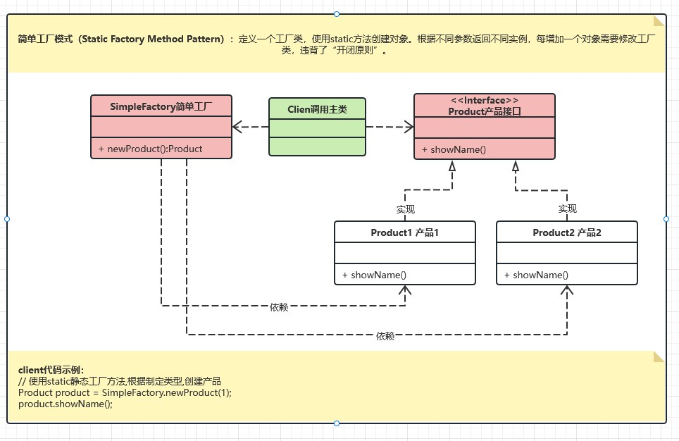

# 面向对象设计原则

7种面向对象设计原则，其中前5条是强约束性的建议都做到，后2条尽量做到即可。


# 类图-关联关系

**耦合度大小排序：**泛化 = 实现 > 组合 > 聚合 > 关联 > 依赖


1. 泛化：指的是继承关系，表达一般和特殊。符号：空心三角箭头的实线，箭头指向父类。（注：UML中只有泛化，继承是开发角度的描述。）

2. 实现：指的是类与接口的关系，表达类实现了接口的特征行为。符号：带三角箭头的虚线，箭头指向接口。

3. 组合：指的是整体与部分的关系, 但部分不能离开整体而单独存在。符号：带实心菱形的实线，菱形指向整体。

4. 聚合：指的是整体和部分关系，且部分可以离开整体而单独存在。符号：空心菱形的实心线，菱形指向整体。

5. 关联：指的是类和类的关系，表达一个类知道另一个类的属性和方法。符号：带普通箭头（或实心三角形箭头）的实心线。

6. 依赖：指的是使用的关系, 即一个类的实现需要另一个类的协助, 所以要尽量不使用双向的互相依赖。符号：带箭头的虚线，指向被依赖的类。

**Java代码示例：**

1. **泛化：**`is-a`

   ```java
   // 接口
   public interface Printable {
       void printDocument();
   }
   
   // 实现类
   public class PDFPrinter implements Printable {
       @Override
       public void printDocument() {
           System.out.println("Printing the document as PDF...");
       }
   }
   ```

2. **实现：**`is-a`

   ```java
   // 接口
   public interface Printable {
       void printDocument();
   }
   
   // 实现类
   public class PDFPrinter implements Printable {
       @Override
       public void printDocument() {
           System.out.println("Printing the document as PDF...");
       }
   }
   ```

3. **组合：**`has-a`

   ```java
   // 整体类
   public class Computer {
       private CPU cpu;
   
       public Computer() {
           this.cpu = new CPU();
       }
   
       public void start() {
           cpu.boot();
       }
   
       // CPU 类在 Computer 类中被组合，Computer 销毁时 CPU 也会被清理
       private class CPU {
           public void boot() {
               System.out.println("CPU booted.");
           }
       }
   }
   ```

4. **聚合：**`has-a`

   ```java
   // 整体类
   public class Library {
       private List<Book> books;
   
       public Library() {
           this.books = new ArrayList<>();
       }
   
       public void addBook(Book book) {
           books.add(book);
       }
   
       // Book 类在 Library 中被聚合，Library 销毁时 Book 可以独立存在
       public static class Book {}
   }
   ```

5. **关联：**`has-a`

   ```java
   public class Student {
       private Teacher teacher;
   
       public Student(Teacher t) {
           this.teacher = t;
       }
   
       public void setTeacher(Teacher teacher) {
           this.teacher = teacher;
       }
   
       public Teacher getTeacher() {
           return teacher;
       }
   
       // Teacher 类与 Student 类关联，彼此独立，生命周期不互相影响
       public static class Teacher {}
   }
   ```

6. **依赖：**`use-a`

   ```java
   public class Formatter {
       public String formatMessage(Message message) {
           return "Formatted: " + message.getMessageContent();
       }
   
       // Formatter 类依赖 Message 类，但不持有其实例
       public static class Message {
           private String messageContent;
   
           public Message(String content) {
               this.messageContent = content;
           }
   
           public String getMessageContent() {
               return messageContent;
           }
       }
   }
   ```

# 类图-表示方法


- 从上到下分为3部分：类名、属性、方法。
- 符号含义：+ public、- private、# protected

# 设计模式

## 23种 VS 24种

**到底几种？**23种！**即GOF的23种设计模式**。还有1个模式：**简单工厂模式**，确实在后续应用比较多，但在1995年未列入GOF。


- 本节列举24种设计模式，其中创建型模式6种、结构型模式7种、行为型模式11种。

- 每个模式从3个角度进行分析：**定义、UML类图、应用**

## 创建型模式

### 1.单例模式（Singleton）

**定义：**

**UML类图：**


**应用：**

### 2.原型模式（Prototype）

**定义：**

**UML类图：**


**应用：**

### 3.简单工厂模式（Static Factory Method Pattern）

**定义：**

**UML类图：**



**应用：**

### 4.工厂方法模式（Factory Method）

**定义：**

**UML类图：**


**应用：**

### 5.抽象工厂模式（Abstract Factory）

**定义：**

**UML类图：**


**应用：**

### 6.建造者模式（Builder）

**定义：**

**UML类图：**


**应用：**

## 结构型模式

### 1.适配器模式（Adapter）

**定义：**

**UML类图：**


**应用：**

### 2.桥接模式（Bridge）

**定义：**

**UML类图：**


**应用：**

### 3.组合模式（Composite）

**定义：**

**UML类图：**


**应用：**

### 4.装饰器模式（Decorator）

**定义：**

**UML类图：**


**应用：**

### 5.外观模式（Facade）

**定义：**

**UML类图：**


**应用：**

### 6.享元模式（Flyweight）

**定义：**

**UML类图：**


**应用：**

### 7.代理模式（Proxy）

**定义：**

**UML类图：**


**应用：**

## 行为型模式

### 1.责任链模式（Chain of Responsibility）

**定义：**

**UML类图：**


**应用：**

### 2.命令模式（Command）

**定义：**

**UML类图：**


**应用：**

### 3.解释器模式（Interpreter）

**定义：**

**UML类图：**


**应用：**

### 4.迭代器模式（Iterator）

**定义：**

**UML类图：**


**应用：**

### 5.中介者模式（Mediator）

**定义：**

**UML类图：**


**应用：**

### 6.备忘录模式（Memento）

**定义：**

**UML类图：**


**应用：**

### 7.观察者模式（Observer）

**定义：**

**UML类图：**


**应用：**

### 8.状态模式（State）

**定义：**

**UML类图：**


**应用：**

### 9.策略模式（Strategy）

**定义：**

**UML类图：**


**应用：**

### 10.模板方法模式（Template Method）

**定义：**

**UML类图：**


**应用：**

### 11.访问者模式（Visitor）

**定义：**

**UML类图：**


**应用：**

> **引用：**
>
> - 一文掌握设计模式（定义+UML类图+应用）https://www.cnblogs.com/dennyzhangdd/p/17462931.html

