# I/O的定义

- I/O 是 Input/Output 的首字母缩写，即输入/输出，它描述的是数据流动的过程。
- 输入/输出是相对而言的。下面将从两个角度出发来进一步理解 IO：

## 计算机结构的视角

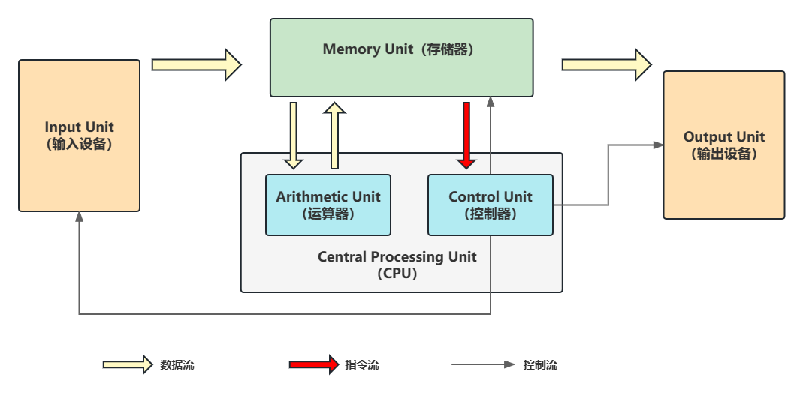

- 根据冯·诺依曼结构，计算机分为五大部分，分别是：控制器、运算器、存储器、输入设备、输出设备。

- 输入设备（如鼠标键盘）和输出设备（如显示器）都属于外设（外部设备），而像**磁盘、网卡这种既属于输入设备又属于输出设备**。

- 从计算机的角度出发的话，操作系统将从输入设备读取到的数据写入到输出设备，这就是一次完整的 I/O 过程。

- 即 I/O 描述了计算机核心（CPU和内存）与外部设备之间的数据转移的过程。

## 应用程序的视角

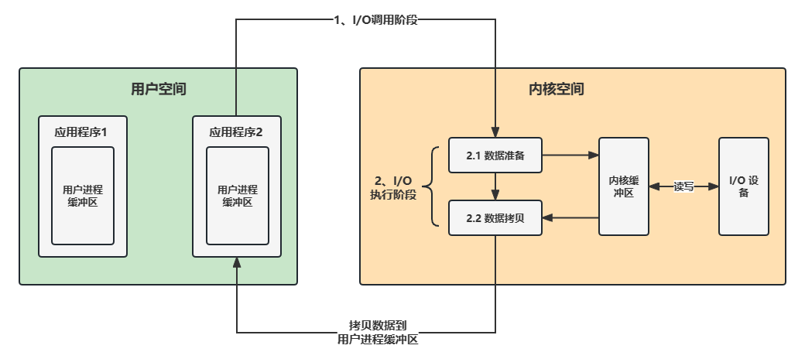

- 我们都知道，应用程序作为一个文件保存在磁盘中，只有加载到内存中成为一个进程才能够运行。
- 为了确保操作系统的安全性和稳定性，操作系统会将内存分为 **内核空间** 和 **用户空间**，进行内存隔离。

- 而我们运行的应用程序都是运行在用户空间的，只有内核空间才能进行系统态级别的资源有关的操作，比如文件管理、进程通信、内存管理等。也就是说，我们想要进行 I/O 操作，就必须依赖内核空间的能力。但是，用户空间的程序是无法直接访问内核空间的。

- 这时我们就需要通过发起系统调用请求操作系统帮忙完成，所以应用程序想要执行 I/O 操作的话，必须通过调用内核提供的 **系统调用** 进行间接访问。

- 我们在平常开发过程中接触最多的就是 **磁盘 I/O（读写文件）**和 **网络 I/O（网络请求和响应）**

- 从应用程序的角度出发的话，我们的应用程序对操作系统的内核发起 I/O 调用（系统调用），操作系统负责的内核执行具体的 I/O 操作。即强调的是通过向内核发起系统调用完成对 I/O 的间接访问。

**上述过程换句话说即一次 I/O 操作实际上包含两个阶段：**

1. **I/O 调用阶段：**应用程序进程向内核发起系统调用
2. **I/O 执行阶段：**内核执行 I/O 操作并返回
   - 内核等待 I/O 设备准备好数据
   - 内核将数据从内核空间拷贝到用户空间

# Linux中的5种IO模型

- **阻塞 I/O**`(Blocking I/O, BIO)`
- **非阻塞 I/O**`(Non-blocking I/O, NIO)`
- **多路复用 I/O **`(I/O Multiplexing)`
- **信号驱动 I/O**`(Signal-driven I/O)`
- **异步 I/O**`(Asynchronous I/O, AIO)`

## 阻塞 I/O

- 阻塞IO是最常见的IO模型。

- 当发起一个IO操作时，比如读取数据，系统会调用read()函数。如果请求的数据没有准备好，此时进程会被挂起（blocked），进入等待状态。直到数据准备好，而且复制到应用进程的缓冲区，这时候才会返回。

- 从调用到返回，整个时间段都是阻塞的，所以被称为阻塞IO。

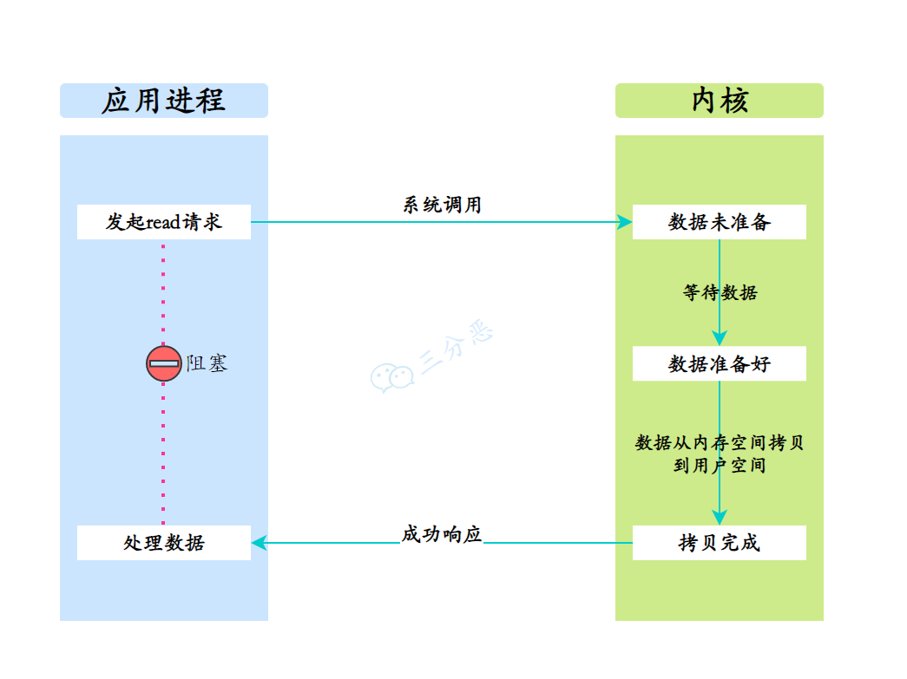

## 非阻塞 I/O

- 阻塞IO，还是比较浪费资源的，那么非阻塞IO就来了。

- 所谓非阻塞IO，是在调用IO操作时，如果缓冲区没有数据的话，直接返回一个错误码。应用进程需要不断轮询，来检查数据是否准备好。数据准备好了，就返回数据。

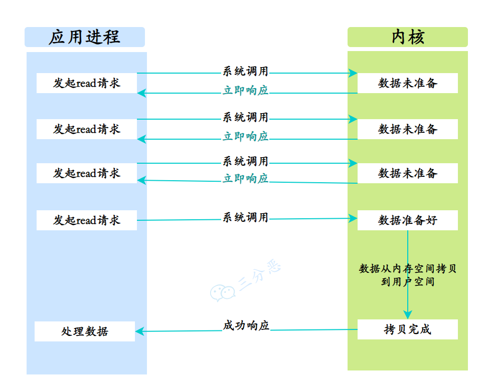

## 多路复用 I/O

- 虽然非阻塞IO相比阻塞IO，性能提升了很多，但是轮询过程中，还是有大量的系统调用，上下文切换的开销比较大。

- 那么，多路复用IO就来了。

- 多路指的是多个数据通道，复用指的是一个进程可以同时监控多个文件描述符（比如socket），当某个文件描述符状态发生变化（比如变得可读或可写），多路复用的函数将返回变化的文件描述符。

- 这样，在数据传输过程中，同一个进程中不同的任务都能被处理。特点是在数据传输过程中，进程能够同时处理多个任务，提高了程序的效率。

- select、poll、epoll 等都是 I/O 多路复用的具体实现。

- 以select/poll为例，进程通过将一个或多个fd（全称是File Descriptor（文件描述符））传递给select或poll系统调用，阻塞在select操作上，这样select/poll可以侦测多个fd是否处于就绪状态。当有fd就绪时，立即回调函数rollback，接下来就可以进行读取。

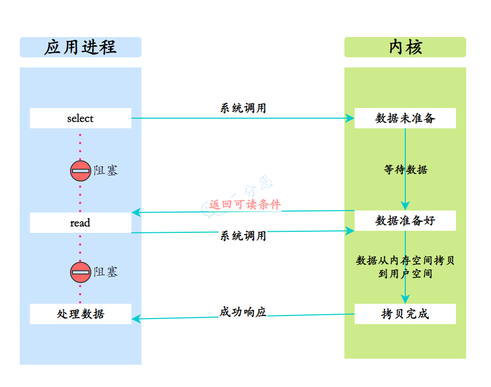

## 信号驱动 I/O

- 信号驱动式IO利用信号机制来进行数据传输。

- 进程首先告诉内核，当数据准备好时，请发送一个SIGIO信号。进程继续执行其他任务，等到收到信号后，再开始进行数据传输。

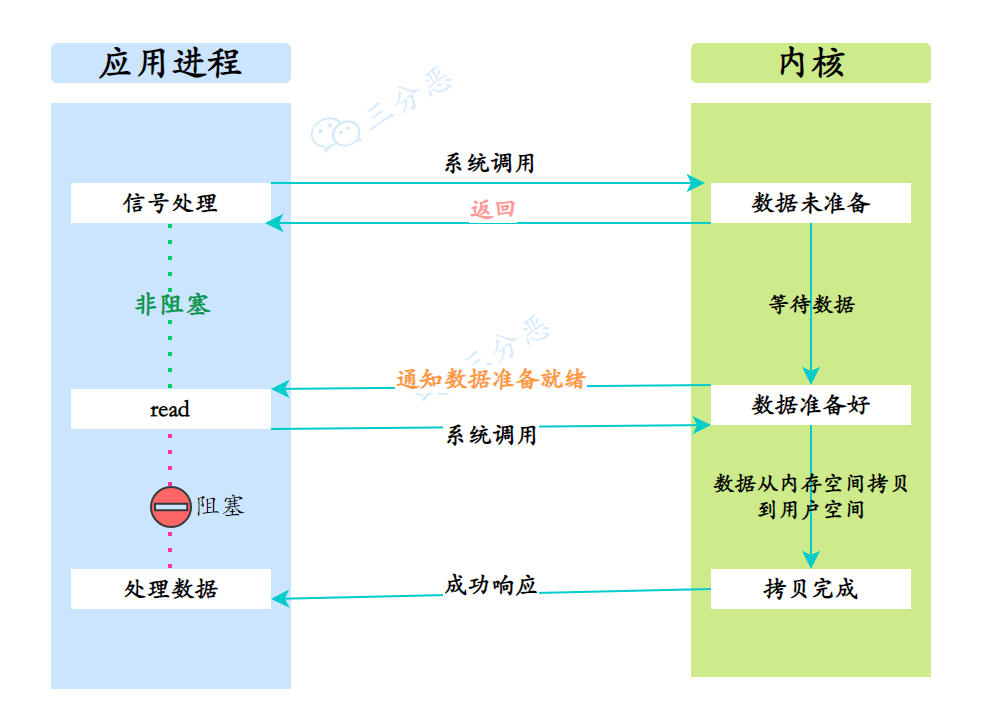

## 异步 I/O

- 异步IO是指当发起一个IO操作后，系统会立即返回。异步IO操作在后台进行数据传输，数据传输完成后，系统将通知进程。这样，在整个数据传输的过程中，进程都可以执行其他任务，不需要等待。

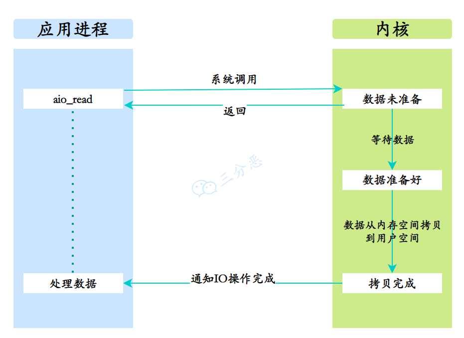

# Java中的3种IO模型

- **阻塞 I/O**`(Blocking I/O, BIO)`
- **非阻塞 I/O**`(Non-blocking I/O, NIO)`
- **异步 I/O**`(Asynchronous I/O, AIO)`

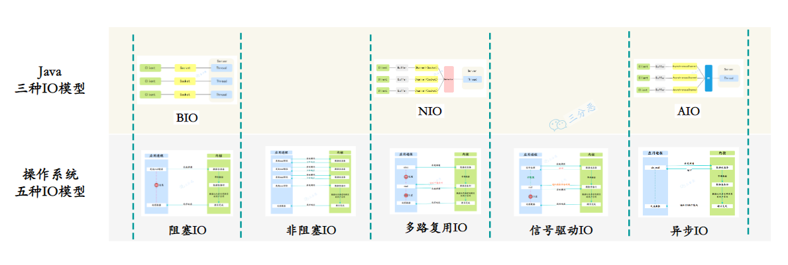

## 阻塞 I/O

- Java BIO就是Java的传统IO模型，对应了操作系统IO模型里的阻塞IO。

- Java BIO相关的实现都位于java.io包下，其通信原理是客户端、服务端之间通过Socket套接字建立管道连接，然后从管道中获取对应的输入/输出流，最后利用输入/输出流对象实现发送/接收信息。

### 代码示例

- **BioServer：**

```java
package com.walle.javaIO.bioDemo;

import java.io.*;
import java.net.ServerSocket;
import java.net.Socket;

/**
 * BIO（同步阻塞IO）模式下的服务器端示例类。
 * @Author wuyong
 * @Date 2024-04-04
 */
public class BioServer {
    public static void main(String[] args) throws IOException {
        // 创建ServerSocket对象，并绑定到8888端口
        ServerSocket server = new ServerSocket(8888);
        System.out.println("===========BIO服务端启动================");

        // 不断监听客户端连接，每个连接都创建一个新的线程处理
        while (true) {
            // 接受客户端的Socket连接
            Socket socket = server.accept();
            new BioServerThread(socket).start(); // 启动处理线程
        }

    }

    /**
     * 处理客户端请求的线程类。
     * 使用同步阻塞IO方式读取客户端消息并回复。
     */
    static class BioServerThread extends Thread {
        // 客户端的Socket连接
        private Socket socket;

        public BioServerThread(Socket socket) {
            this.socket = socket;
        }

        @Override
        public void run() {
            try {
                // 读取客户端发送的消息
                InputStream inputStream = socket.getInputStream();
                BufferedReader bufferedReader = new BufferedReader(new InputStreamReader(inputStream));
                String msg;
                while ((msg = bufferedReader.readLine()) != null) {
                    System.out.println("收到客户端消息：" + msg);
                }

                // 向客户端发送消息
                OutputStream outputStream = socket.getOutputStream();
                PrintStream printStream = new PrintStream(outputStream);
                printStream.println("你好，吊毛！");
                printStream.flush(); // 刷新输出流，确保消息被发送

                // 关闭Socket的输出流，表示服务端已发送完消息
                socket.shutdownOutput();
            } catch (IOException e) {
                e.printStackTrace();
            }
        }
    }
}
```

- **BioClient：**

```java
package com.walle.javaIO.bioDemo;

import java.io.*;
import java.net.Socket;
import java.util.Arrays;
import java.util.List;

/**
 * BIO（同步阻塞IO）模式的客户端示例类。
 * 该类用于创建一个简单的客户端，它会连接到服务器，发送一个消息，然后接收并打印服务器的响应。
 *
 * @Author wuyong
 * @Date 2024-04-04
 */
public class BioClient {
    public static void main(String[] args) throws IOException {
        List<String> names = Arrays.asList("帅哥", "靓仔", "坤坤");
        // 循环创建多个客户端连接，每个连接发送不同的问候消息
        for (String name : names) {
            // 创建Socket对象并连接到服务器
            Socket socket = new Socket("127.0.0.1", 8888);
            System.out.println("===========BIO客户端启动================");

            // 获取Socket的输出流，用于向服务器发送数据
            OutputStream outputStream = socket.getOutputStream();
            // 构建要发送的消息，并将其转换为字节流发送给服务器
            String hello = "你好，" + name + "!";
            outputStream.write(hello.getBytes());

            // 清空输出流并关闭Socket的输出功能，准备读取输入流
            outputStream.flush();
            socket.shutdownOutput();

            // 获取Socket的输入流，用于读取服务器返回的数据
            InputStream inputStream = socket.getInputStream();
            BufferedReader bufferedReader = new BufferedReader(new InputStreamReader(inputStream));
            // 读取并打印服务器发送的消息
            String msg;
            while ((msg = bufferedReader.readLine()) != null) {
                System.out.println("收到服务端消息：" + msg);
            }

            // 关闭输入流、输出流和Socket
            inputStream.close();
            outputStream.close();
            socket.close();
        }
    }
}
```

- 先启动`BioServer`，再启动`BioClient`，运行结果：

```java
===========BIO服务端启动================
收到客户端消息：你好，帅哥!
收到客户端消息：你好，靓仔!
收到客户端消息：你好，坤坤!
```

```java
===========BIO客户端启动================
收到服务端消息：你好，吊毛！
===========BIO客户端启动================
收到服务端消息：你好，吊毛！
===========BIO客户端启动================
收到服务端消息：你好，吊毛！
```

- 在上述Java-BIO的通信过程中，如果客户端一直没有发送消息过来，服务端则会一直等待下去，从而服务端陷入阻塞状态。同理，由于客户端也一直在等待服务端的消息，如果服务端一直未响应消息回来，客户端也会陷入阻塞状态。
- 在BioServer定义了一个类BioServerThread，继承了Thread类，run方法里主要是通过socket和流来读取客户端的消息，以及发送消息给客户端，每处理一个客户端的Socket连接，就得新建一个线程。

- 同时，IO读写操作也是阻塞的，如果客户端一直没有发送消息过来，线程就会进入阻塞状态，一直等待下去。

- 在BioClient里，循环创建Socket，向服务端收发消息，客户端的读写也是阻塞的。

**在这个Demo里就体现了BIO的两个特点：**

- 一个客户端连接对应一个处理线程
- 读写操作都是阻塞的

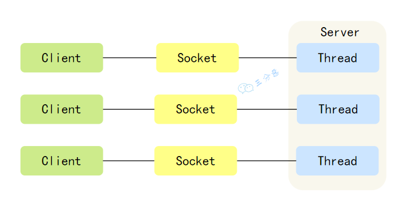

毫无疑问，不管是创建太多线程，还是阻塞读写，都会浪费服务器的资源。

## 非阻塞 I/O

- 那么我们就进入Java的下一种IO模型——Java NIO，它对应操作系统IO模型中的多路复用IO，底层采用了epoll实现。

- Java-NIO则是JDK1.4中新引入的API，它在BIO功能的基础上实现了非阻塞式的特性，其所有实现都位于java.nio包下。NIO是一种基于通道、面向缓冲区的IO操作，相较BIO而言，它能够更为高效的对数据进行读写操作，同时与原先的BIO使用方式也大有不同。

### 代码示例

- **NioServer：**

```java
package com.walle.javaIO.nioDemo;

import java.io.IOException;
import java.net.InetSocketAddress;
import java.nio.ByteBuffer;
import java.nio.channels.SelectionKey;
import java.nio.channels.Selector;
import java.nio.channels.ServerSocketChannel;
import java.nio.channels.SocketChannel;
import java.util.Iterator;

/**
 * NIO服务器示例，用于演示非阻塞I/O的服务器端实现。
 * @Author wuyong
 * @Date 2024-04-04
 */
public class NioServer {
    public static void main(String[] args) throws IOException {
        // 初始化选择器
        Selector selector = Selector.open();
        // 打开服务端套接字通道
        ServerSocketChannel serverSocketChannel = ServerSocketChannel.open();
        // 绑定端口
        serverSocketChannel.socket().bind(new InetSocketAddress(8888));
        // 设置非阻塞模式
        serverSocketChannel.configureBlocking(false);
        // 注册选择器，监听连接请求
        serverSocketChannel.register(selector, SelectionKey.OP_ACCEPT);
        System.out.println("===========NIO服务端启动============");

        while (true) {
            // 超时等待客户端连接，避免无限阻塞
            if (selector.select(1000) == 0) {
                System.out.println("===========NIO服务端超时等待============");
                continue;
            }

            // 处理就绪的客户端连接请求
            Iterator<SelectionKey> iterator = selector.selectedKeys().iterator();
            while (iterator.hasNext()) {
                SelectionKey key = iterator.next();

                // 处理连接请求
                if (key.isAcceptable()) {
                    SocketChannel socketChannel = ((ServerSocketChannel) key.channel()).accept();
                    socketChannel.configureBlocking(false);
                    // 注册读事件，准备读取客户端数据
                    socketChannel.register(selector, SelectionKey.OP_READ, ByteBuffer.allocate(1024));
                    System.out.println("成功连接客户端");
                }

                // 处理读事件，读取客户端数据
                if (key.isReadable()) {
                    SocketChannel socketChannel = (SocketChannel) key.channel();
                    try {
                        ByteBuffer buffer = (ByteBuffer) key.attachment();
                        if (buffer == null) {
                            buffer = ByteBuffer.allocate(1024);
                            key.attach(buffer);
                        }
                        buffer.clear();
                        int len = socketChannel.read(buffer);
                        if (len > 0) {
                            buffer.flip();
                            String message = new String(buffer.array(), 0, len);
                            System.out.println("收到客户端消息：" + message);
                        } else if (len < 0) {
                            // 关闭连接
                            key.cancel();
                            socketChannel.close();
                            continue;
                        }
                        // 准备写事件，向客户端发送消息
                        socketChannel.register(selector, SelectionKey.OP_WRITE, buffer);
                    } catch (IOException e) {
                        // 异常处理：关闭连接
                        key.cancel();
                        socketChannel.close();
                    }
                }

                // 处理写事件，向客户端发送消息
                if (key.isWritable()) {
                    SocketChannel socketChannel = (SocketChannel) key.channel();
                    ByteBuffer buffer = (ByteBuffer) key.attachment();
                    String hello = "你好，坤坤！";
                    buffer.clear();
                    buffer.put(hello.getBytes());
                    buffer.flip();
                    socketChannel.write(buffer);
                    buffer.clear();
                    System.out.println("向客户端发送消息：" + hello);
                    // 准备读事件，等待客户端的下一次消息
                    socketChannel.register(selector, SelectionKey.OP_READ, buffer);
                }

                // 移除已处理的SelectionKey
                iterator.remove();
            }
        }

    }
}
```

- **NioClient：**

```java
package com.walle.javaIO.nioDemo;

import java.io.IOException;
import java.net.InetSocketAddress;
import java.nio.ByteBuffer;
import java.nio.channels.SelectionKey;
import java.nio.channels.Selector;
import java.nio.channels.SocketChannel;

/**
 * NIO客户端示例。用于演示如何使用非阻塞I/O与服务器进行通信。
 * @Author wuyong
 * @Date 2024-04-04
 */
public class NioClient {
    public static void main(String[] args) throws IOException {
        // 创建SocketChannel并初始化连接地址
        SocketChannel socketChannel = SocketChannel.open(new InetSocketAddress("127.0.0.1", 8888));
        System.out.println("==============NIO客户端启动================");

        // 设置SocketChannel为非阻塞模式
        socketChannel.configureBlocking(false);

        // 准备发送的消息
        String hello="你好，靓仔！";
        ByteBuffer buffer = ByteBuffer.wrap(hello.getBytes());

        // 向服务器发送消息
        socketChannel.write(buffer);
        System.out.println("发送消息：" + hello);
        buffer.clear();

        // 注册Selector并设置监听读事件，为接收服务器响应做准备
        socketChannel.register(Selector.open(), SelectionKey.OP_READ, buffer);

        while (true) {
            // 从服务器读取数据
            if (socketChannel.read(buffer) > 0) {
                buffer.flip();
                // 处理接收到的数据
                String msg = new String(buffer.array(), 0, buffer.limit());
                System.out.println("收到服务端消息：" + msg);
                break; // 接收到消息后退出循环
            }
        }

        // 关闭SocketChannel的输入流，准备关闭连接
        socketChannel.shutdownInput();
        // 关闭SocketChannel
        socketChannel.close();
    }
}
```

- 先运行`NioServer`，再运行`NioClient`，运行结果：

```java
===========NIO服务端启动============
===========NIO服务端超时等待============
===========NIO服务端超时等待============
成功连接客户端
收到客户端消息：你好，靓仔！
向客户端发送消息：你好，坤坤！
```

```java
==============NIO客户端启动================
发送消息：你好，靓仔！
收到服务端消息：你好，坤坤！
```

- 我们在这个案例里实现了一个比较简单的Java NIO 客户端服务端通信，里面有两个小的点需要注意，注册到选择器上的通道都必须要为非阻塞模型，同时通过缓冲区传输数据时，必须要调用`flip()`方法切换为读取模式。

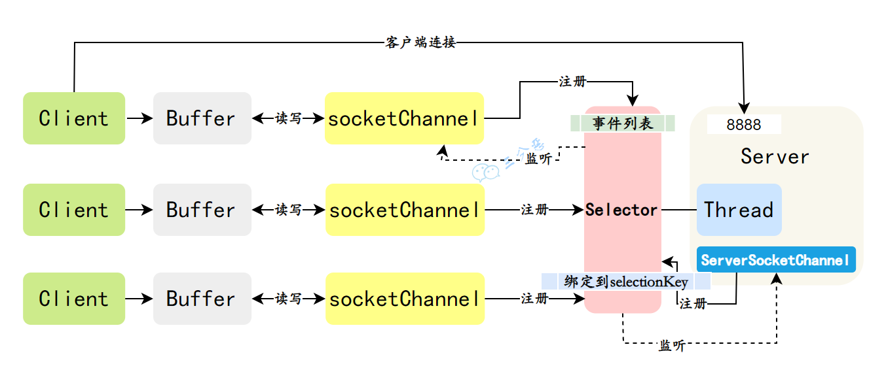

Java-NIO中有三个核心概念：**`Buffer`（缓冲区）、`Channel`（通道）、`Selector`（选择器）**。

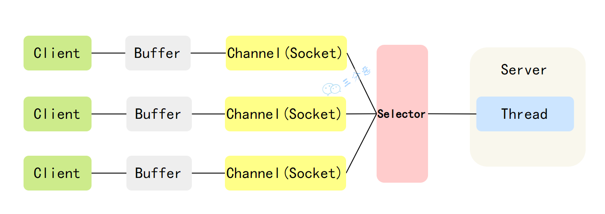

- 每个客户端连连接本质上对应着一个Channel通道，每个通道都有自己的Buffer缓冲区来进行读写，这些Channel被Selector选择器管理调度

- Selector负责轮询所有已注册的Channel，监听到有事件发生，才提交给服务端线程处理，服务端线程不需要做任何阻塞等待，直接在Buffer里处理Channel事件的数据即可，处理完马上结束，或返回线程池供其他客户端事件继续使用。

- 通过Selector，服务端的一个Thread就可以处理多个客户端的请求

- Buffer（缓冲区）就是饭店用来存放食材的储藏室，当服务员点餐时，需要从储藏室中取出食材进行制作。

- Channel（通道）是用于传输数据的车道，就像饭店里的上菜窗口，可以快速把点好的菜品送到客人的桌上。

- Selector（选择器）就是大堂经理，负责协调服务员、厨师和客人的配合和沟通，以保证整个就餐过程的效率和顺畅。

## 异步 I/O

- `Java-AIO`也被成为`NIO2`，它是在`NIO`的基础上，引入了新的异步通道的概念，并提供了异步文件通道和异步套接字的实现。

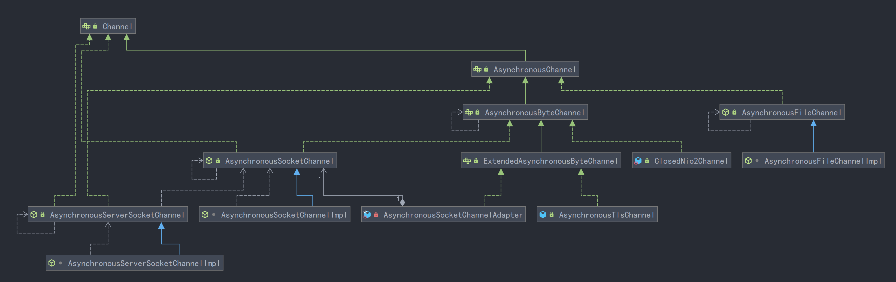

- 它们的主要区别就在于这个异步通道，见名知意：使用异步通道去进行IO操作时，所有操作都为异步非阻塞的，当调用read()/write()/accept()/connect()方法时，本质上都会交由操作系统去完成，比如要接收一个客户端的数据时，操作系统会先将通道中可读的数据先传入read()回调方法指定的缓冲区中，然后再主动通知Java程序去处理。

### 代码示例

- **AioServer：**

```java
package com.walle.javaIO.aioDemo;

import java.io.IOException;
import java.net.InetSocketAddress;
import java.nio.ByteBuffer;
import java.nio.channels.AsynchronousChannelGroup;
import java.nio.channels.AsynchronousServerSocketChannel;
import java.nio.channels.AsynchronousSocketChannel;
import java.nio.channels.CompletionHandler;
import java.util.concurrent.Executors;
import java.util.concurrent.TimeUnit;

/**
 * 异步IO（AIO）服务器示例类。
 * 主要用于演示如何使用AIO方式实现一个简单的服务器，能够接收客户端连接并发送消息。
 *
 * @Author wuyong
 * @Date 2024-04-04
 */
public class AioServer {
    public static void main(String[] args) throws Exception {
        // 创建异步通道组，指定线程池大小，用于处理IO事件
        AsynchronousChannelGroup group = AsynchronousChannelGroup.withFixedThreadPool(10, Executors.defaultThreadFactory());
        // 创建异步服务器Socket通道，并绑定到指定端口
        AsynchronousServerSocketChannel server = AsynchronousServerSocketChannel.open(group).bind(new InetSocketAddress(8888));
        System.out.println("=============AIO服务端启动=========");

        // 异步等待接收客户端连接请求
        server.accept(null, new CompletionHandler<AsynchronousSocketChannel, Object>() {
            // 用于读取数据的ByteBuffer
            final ByteBuffer buffer = ByteBuffer.allocate(1024);

            @Override
            public void completed(AsynchronousSocketChannel channel, Object attachment) {
                System.out.println("客户端连接成功");
                try {
                    buffer.clear();
                    // 异步读取客户端发送的数据
                    channel.read(buffer, null, new CompletionHandler<Integer, Object>() {
                        @Override
                        public void completed(Integer len, Object attachment) {
                            buffer.flip();
                            // 将读取到的数据转换为字符串
                            String message = new String(buffer.array(), 0, len);
                            System.out.println("收到客户端消息：" + message);

                            // 异步向客户端发送消息
                            channel.write(ByteBuffer.wrap(("你好，阿坤！").getBytes()), null, new CompletionHandler<Integer, Object>() {
                                @Override
                                public void completed(Integer result, Object attachment) {
                                    // 关闭通道的输出流
                                    try {
                                        channel.shutdownOutput();
                                    } catch (IOException e) {
                                        e.printStackTrace();
                                    }
                                }

                                @Override
                                public void failed(Throwable exc, Object attachment) {
                                    exc.printStackTrace();
                                    // 关闭通道
                                    try {
                                        channel.close();
                                    } catch (IOException e) {
                                        e.printStackTrace();
                                    }
                                }
                            });
                        }

                        @Override
                        public void failed(Throwable exc, Object attachment) {
                            exc.printStackTrace();
                            // 关闭通道
                            try {
                                channel.close();
                            } catch (IOException e) {
                                e.printStackTrace();
                            }
                        }
                    });
                } catch (Exception e) {
                    e.printStackTrace();
                }
                // 继续等待下一个客户端连接
                server.accept(null, this);
            }

            @Override
            public void failed(Throwable exc, Object attachment) {
                exc.printStackTrace();
                // 继续等待下一个客户端连接
                server.accept(null, this);
            }
        });
        // 等待异步通道组处理所有连接，直到程序被终止
        group.awaitTermination(Long.MAX_VALUE, TimeUnit.SECONDS);
    }

}
```

- **AioClient：**

```java
package com.walle.javaIO.aioDemo;

import java.io.IOException;
import java.net.InetSocketAddress;
import java.nio.ByteBuffer;
import java.nio.channels.AsynchronousSocketChannel;
import java.nio.channels.CompletionHandler;

/**
 * 异步IO客户端示例类
 * 主要用于演示如何使用异步方式与服务器进行通信。
 *
 * @Author wuyong
 * @Date 2024-04-04
 */
public class AioClient {
    public static void main(String[] args) throws Exception {
        // 创建异步Socket通道
        AsynchronousSocketChannel client = AsynchronousSocketChannel.open();

        // 创建ByteBuffer
        final ByteBuffer buffer = ByteBuffer.wrap(("你好，靓仔！").getBytes());
        // 异步连接服务器
        client.connect(new InetSocketAddress("127.0.0.1", 8888), null, new CompletionHandler<Void, Object>() {
            // 当连接操作完成时调用此方法
            @Override
            public void completed(Void result, Object attachment) {
                // 异步发送消息给服务器
                client.write(buffer, null, new CompletionHandler<Integer, Object>() {

                    // 创建ByteBuffer
                    final ByteBuffer readBuffer = ByteBuffer.allocate(1024);

                    // 当消息写入完成时调用此方法
                    @Override
                    public void completed(Integer result, Object attachment) {
                        // 准备读取服务器响应
                        readBuffer.clear();
                        // 异步读取数据
                        client.read(readBuffer, null, new CompletionHandler<Integer, Object>() {
                            // 当数据读取完成时调用此方法
                            @Override
                            public void completed(Integer result, Object attachment) {
                                // 处理接收到的数据
                                readBuffer.flip();
                                String msg = new String(readBuffer.array(), 0, result);
                                System.out.println("收到服务端消息：" + msg);
                            }

                            // 当读取操作失败时调用此方法
                            @Override
                            public void failed(Throwable exc, Object attachment) {
                                // 处理异常并关闭连接
                                exc.printStackTrace();
                                try {
                                    client.close();
                                } catch (IOException e) {
                                    e.printStackTrace();
                                }
                            }
                        });
                    }

                    // 当写操作失败时调用此方法
                    @Override
                    public void failed(Throwable exc, Object attachment) {
                        // 处理异常并关闭连接
                        exc.printStackTrace();
                        try {
                            client.close();
                        } catch (IOException e) {
                            e.printStackTrace();
                        }
                    }
                });
            }

            // 当连接操作失败时调用此方法
            @Override
            public void failed(Throwable exc, Object attachment) {
                // 处理异常并关闭连接
                exc.printStackTrace();
                try {
                    client.close();
                } catch (IOException e) {
                    e.printStackTrace();
                }
            }
        });
        // 等待一段时间以确保连接操作完成
        Thread.sleep(1000);
        // 关闭输入流和Socket通道
        client.shutdownInput();
        client.close();
    }
}
```

- 先运行`AioServer`，再运行`AioClient`，运行结果：

```java
=============AIO服务端启动=========
客户端连接成功
收到客户端消息：你好，靓仔！
```

```java
收到服务端消息：你好，阿坤！
```

- 可以看到，所有的操作都是异步进行，通过completed接收异步回调，通过failed接收错误回调。

- 而且我们发现，相较于之前的NIO而言，AIO其中少了Selector选择器这个核心组件，选择器在NIO中充当了协调者的角色。

- 但在Java-AIO中，类似的角色直接由操作系统担当，而且不是采用轮询的方式监听IO事件，而是采用一种类似于“订阅-通知”的模式。

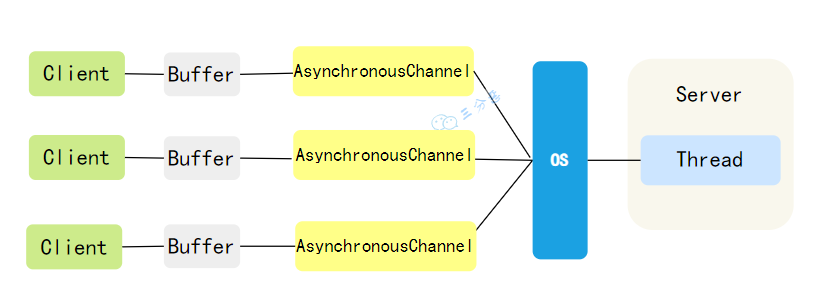

- 在AIO中，所有创建的通道都会直接在OS上注册监听，当出现IO请求时，会先由操作系统接收、准备、拷贝好数据，然后再通知监听对应通道的程序处理数据。

- Java-AIO这种异步非阻塞式IO也是由操作系统进行支持的，在Windows系统中提供了一种异步IO技术：IOCP(I/O Completion Port，所以Windows下的Java-AIO则是依赖于这种机制实现。不过在Linux系统中由于没有这种异步IO技术，所以Java-AIO在Linux环境中使用的还是epoll这种多路复用技术进行模拟实现的。

- 因为Linux的异步IO技术实际上不太成熟，所以Java-AIO的实际应用并不是太多，比如大名鼎鼎的网络通信框架Netty就没有采用Java-AIO，而是使用Java-NIO，在代码层面，自行实现异步。

## 小结

- Java的三种IO机制，它们的特点，我们直接看下图：

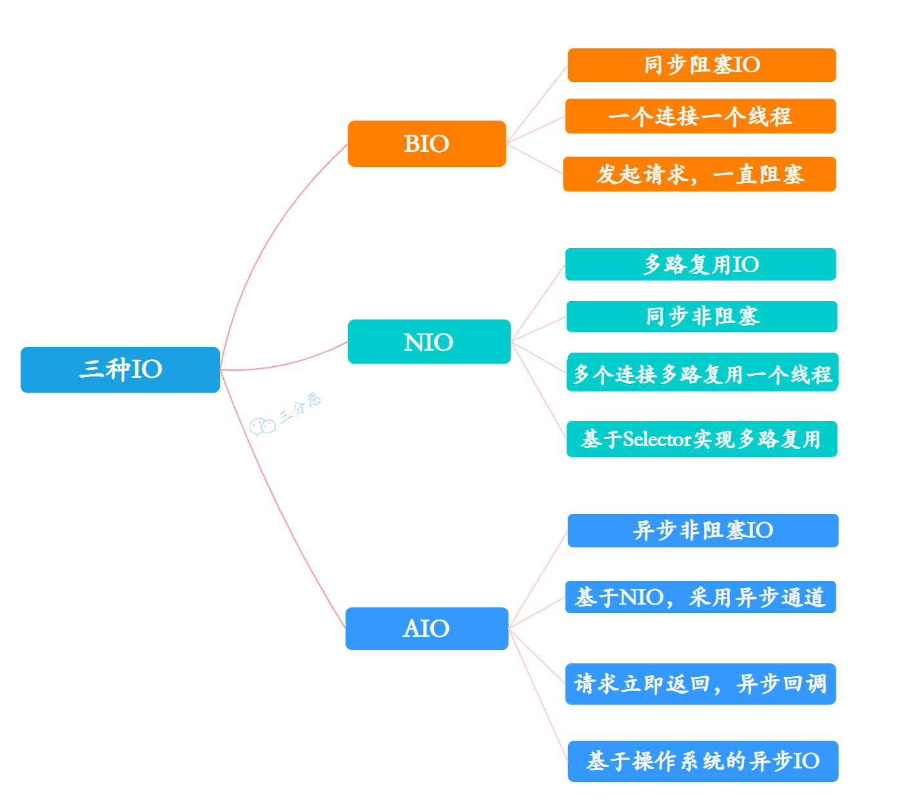

- 我们也发现，虽然Java-NIO、Java-AIO，在性能上比Java-BIO要强很多，但是可以看到，写法上一个比一个难搞，不过好在基本也没人直接用Java-NIO、Java-AIO，如果要进行网络通信，一般都会采用Netty，它对原生的Java-NIO进行了封装优化，接下来，我们会继续走近Netty，敬请期待。

# Netty

- 未完待续...

  

> 引用：
>
> - Java IO模型详解 https://blog.csdn.net/m0_53067943/article/details/128957719
>
> - 一顿饭的事儿，搞懂了Linux5种IO模型 https://fighter3.blog.csdn.net/article/details/130571808
> - Java 3种IO模型，一次搞懂 https://fighter3.blog.csdn.net/article/details/130614023
