# 什么是JUC

指的是java.util下的三个并发编程工具包。

- java.util.concurrent 
- java.util.concurrent.atomic 
- java.util.concurrent.locks

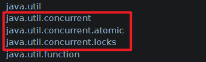

# 线程的相关概念

1. **进程**：
   - 进程是操作系统中资源分配和调度的基本单位，代表着系统中运行的一个程序实例。
   - 每个进程都有独立的内存空间和其他系统资源。
   - 不同的进程之间相互隔离，通过进程间通信（IPC）机制进行信息交互。
2. **线程**：
   - 线程是操作系统能够进行运算调度的最小单位，它被包含在进程之中，是进程内部的一个独立执行流。
   - 一个进程中可以包含多个线程。这些线程共享进程的内存空间和其他资源，因此创建和切换线程的开销小于进程。
   - 多线程可以实现进程内部的并发执行，提高CPU利用率。
3. **协程**：
   - 协程是一种用户态的轻量级线程实现，也称作协作式多任务。
   - 它不同于操作系统调度的线程，协程的调度完全由用户程序控制。
   - 协程可以在函数调用时保存上下文并在适当时候恢复执行，允许在单个线程中模拟出多任务效果，且没有线程切换的开销。
4. **同步**：
   - 同步指的是一个操作完成后才会执行下一个操作。
   - 比如在编程中调用一个函数，直到该函数返回结果后，后续代码才会继续执行。
   - 同步执行不会立即返回控制权，而是等待任务完成。
5. **异步**：
   - 异步则是指发起一个操作后，无需等待该操作完成即可继续执行后续代码。
   - 操作结果通过回调，或者通过事件等机制通知调用者。
   - 这种模式下，程序不会阻塞等待某个操作结束，即调用发出后不必等待响应就可以去做别的事情。
6. **阻塞**：
   - 阻塞是指在执行某个操作（如I/O请求）时，调用线程或进程会暂停执行，直到该操作完成。
   - 在此期间，操作系统可能将CPU时间片分配给其他可执行的线程或进程。
7. **非阻塞**：
   - 非阻塞操作则是指调用发出后，调用者不会被挂起，而是立即返回一个状态（如“未准备好”）。
   - 然后调用者可以选择轮询检查操作是否完成，或者通过事件通知机制得知操作完成。
8. **并发**：
   - 并发是指在一段时间内多个任务交替执行，从宏观上看似乎同时发生，但实际上由于CPU时间片轮转，微观上并非真正的同时执行。
   - 并发强调的是多个任务在执行时间上的重叠。
9. **并行**：
   - 并行指两个或多个任务在同一时刻真正地同时执行，尤其在多核或多处理器环境中，每个核心可以独立执行任务，实现物理上的同时处理。
   - 并行强调的是在硬件层面上的真正同时执行。
10. **串行**：
    - 串行是指任务按照严格的顺序执行，一个任务执行完毕后下一个任务才能开始。
    - 在单核系统中，如果没有并发机制的话，所有任务只能串行执行。
    - 即使在多核系统中，若没有充分利用多核特性，也可能表现为串行执行。

# 线程的创建方式

Java实现多线程的方式主要有以下4种：

1. **继承Thread类** 
2. **实现Runnable接口**
3. **实现Callable接口** 
4. **开启线程池**

## 继承Thread类

```java
public class MyThread extends Thread {
    @Override
    public void run() {
        // 任务代码
        System.out.println("线程 " + Thread.currentThread().getName() + " 正在运行...");
    }

    public static void main(String[] args) {
        MyThread thread = new MyThread();
        thread.start(); // 启动线程
    }
}
```

### start()方法源码

**注意：**Java语言本身是不能直接开启线程的，通过查看**start()方法的源代码**，可以看到Java是通过调用一个叫**start0()的native方法**来实现开启线程的操作的。

```java
/**
 * Thread.java源码中start()方法。
 */
public synchronized void start() {
   
        if (threadStatus != 0)
            throw new IllegalThreadStateException();
        
        group.add(this);

        boolean started = false;
        try {
            // 调用start0()方法
            start0();
            started = true;
        } finally {
            try {
                if (!started) {
                    group.threadStartFailed(this);
                }
            } catch (Throwable ignore) {
                
            }
        }
    }
    // 由操作系统本地方法创建
    private native void start0();
```

### Java中的线程

- **Java默认有两个线程：main 和 GC**
- main是用户线程
- GC是守护线程

用户线程和守护线程：

- 用户线程：自定义线程（比如new Thread()）
- 守护线程：后台中一种特殊的线程，比如垃圾回收
- **当JVM中所有的用户线程都结束后，JVM会自动关闭，即使此时还有守护线程在运行。**

## 实现Runnable接口

```java
public class RunnableExample implements Runnable {
    @Override
    public void run() {
        // 任务代码
        System.out.println("线程 " + Thread.currentThread().getName() + " 正在运行...");
    }

    public static void main(String[] args) {
        Runnable task = new RunnableExample();
        Thread thread = new Thread(task);
        thread.start();
    }
}
```

## 实现Callable接口

```java
public class CallableExample implements Callable<String> {
    @Override
    public String call() throws Exception {
        // 任务代码，可以有返回值
        System.out.println("线程 " + Thread.currentThread().getName() + " 正在运行...");
        return "Callable任务已完成";
    }

    public static void main(String[] args) throws InterruptedException, ExecutionException {
        Callable<String> callable = new CallableExample();
        FutureTask<String> futureTask = new FutureTask<>(callable);
        Thread thread = new Thread(futureTask);
        thread.start();

        // 获取Callable任务的结果
        String result = futureTask.get();
        System.out.println("任务结果：" + result);
    }
}
```

### Runnable接口和Callable接口区别

1. 是否有返回值：Runnable无返回值，Callable有返回值
2. 是否抛出异常：call方法计算一个结果，如果不能这样做，就会抛出异常
3. 实现方法名称不同，Runnable接口是run方法，Callable接口是call方法

## 开启线程池

```java
public class ThreadPoolExample implements Runnable {
    @Override
    public void run() {
        // 任务代码
        System.out.println("线程 " + Thread.currentThread().getName() + " 正在运行...");
    }

    public static void main(String[] args) {
        // 创建固定大小的线程池
        ExecutorService executorService = Executors.newFixedThreadPool(5);

        // 提交任务
        for (int i = 0; i < 5; i++) {
            executorService.submit(new ThreadPoolExample());
        }

        // 关闭线程池
        executorService.shutdown();
    }
}
```

# 多线程的编程步骤

## 编程步骤

**第一步：创建资源类，定义属性和操作方法**

**第二步：创建多线程去调用资源类的方法**

## 卖票例子

```java
public class SaleTicket {
    public static void main(String[] args) {

        Ticket ticket = new Ticket();
        
        // 第二步：创建多线程调用资源类的方法，这里开启三个线程A,B,C卖票
        new Thread(new Runnable() {
            @Override
            public void run() {
                for (int i = 0; i < 1000; i++) {
                    ticket.sale();
                }
            }
        }, "A").start();

        new Thread(new Runnable() {
            @Override
            public void run() {
                for (int i = 0; i < 1000; i++) {
                    ticket.sale();
                }
            }
        }, "B").start();

        new Thread(new Runnable() {
            @Override
            public void run() {
                for (int i = 0; i < 1000; i++) {
                    ticket.sale();
                }
            }
        }, "C").start();

    }
}

// 第一步：创建资源类，定义属性和操作方法
class Ticket {
    private int num = 1000;

    public synchronized void sale() {
        if (num > 0) {
            num--;
            System.out.println(Thread.currentThread().getName() + "卖出一张票:" + "余票" + num);
        }
    }
}

```

# 线程的生命周期

线程从开启到执行完成，会经历一些状态，这些状态一起组成了线程的生命周期。

## 线程的状态

```java
/**
 * Thread.java源码中State枚举定义了线程可能处于的不同状态。
 */
public enum State {
    
        NEW,

        RUNNABLE,

        BLOCKED,

        WAITING,

        TIMED_WAITING,

        TERMINATED;
    }
```

## 线程的生命周期

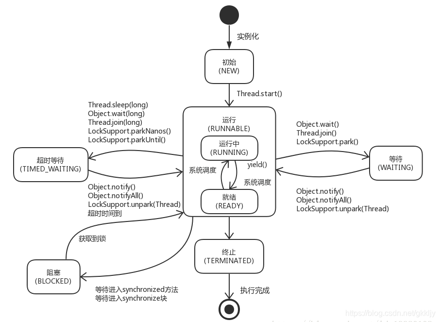

1. **新建状态（NEW）** 

   当一个 Thread 对象被创建但尚未调用其 start() 方法时，线程处于新建状态。

   此时线程对象已存在，但并没有分配到任何操作系统资源，也没有开始执行。 

2. **可运行状态（RUNNABLE）**

   包括了两个子状态： 从Java的角度看，RUNNABLE状态包括了READY和RUNNING两种实际的操作系统状态。

   i. 就绪状态（READY）: 

   线程已经调用了 start() 方法，且线程调度器随时可以将其分配给CPU进行执行。

   线程在就绪队列中等待，一旦得到CPU时间片，它就转为运行状态。

   ii. 运行状态（RUNNING）: 

   线程正在执行其 run() 方法。

3. **阻塞状态（BLOCKED）** 

   线程试图获取一个监视器锁（synchronized块或方法），但锁被其他线程持有，因此该线程会暂时停止执行并进入阻塞状态，直到获得锁。

4. **等待状态（WAITING）**

   线程调用了 `Object.wait() 、 Thread.join() 或者 LockSupport.park()` 方法，进入了无限期等待状态。

   线程不会继续执行，除非其他线程对此线程发出 notify() 或者 notifyAll() 信号。

5. **定时等待状态（TIMED_WAITING）**

   线程调用了带有超时参数的方法如 `Thread.sleep(long millis) 、 Object.wait(long timeout) 、 Thread.join(long millis) 、 LockSupport.parkNanos() 或 LockSupport.parkUntil()` 后进入此状态。

   在这个状态下，线程将在指定的时间过后自动返回，不再需要其他线程的显式唤醒。

6. **终止状态（TERMINATED）**

   线程完成了它的任务或者因为异常退出了 run() 方法，线程已经结束执行。

   一旦线程达到终止状态，就不能再次变为其他状态。

## wait()和sleep()的区别

1. 来自不同的类

   wait => Object，任何对象实例都能调用

   sleep => Thread，Thread的静态方法

2. 关于锁的释放

   wait会释放锁；sleep不会释放锁，它也不需要占用锁

3. 使用范围、捕获异常不同

   wait：必须在同步代码块中使用，不需要捕获异常

   sleep：可以在任何地方使用，必须要捕获异常

# Synchronized与Lock锁

## synchronized实现卖票例子

```java
public class SaleTicket {
    public static void main(String[] args) {

        Ticket ticket = new Ticket();
        
        // 创建多线程调用资源类的方法:这里开启三个线程A,B,C卖票
        new Thread(new Runnable() {
            @Override
            public void run() {
                for (int i = 0; i < 1000; i++) {
                    ticket.sale();
                }
            }
        }, "A").start();

        new Thread(new Runnable() {
            @Override
            public void run() {
                for (int i = 0; i < 1000; i++) {
                    ticket.sale();
                }
            }
        }, "B").start();

        new Thread(new Runnable() {
            @Override
            public void run() {
                for (int i = 0; i < 1000; i++) {
                    ticket.sale();
                }
            }
        }, "C").start();

    }
}

// 创建资源类，定义属性和操作方法
class Ticket {
    private int num = 1000;

    public synchronized void sale() {
        if (num > 0) {
            num--;
            System.out.println(Thread.currentThread().getName() + "卖出一张票:" + "余票" + num);
        }
    }
}

```

## lock锁实现卖票例子

```java
import java.util.concurrent.locks.ReentrantLock;

public class LSaleTicket {
    public static void main(String[] args) {
        LTicket lTicket = new LTicket();

        new Thread(() -> {
            for (int i = 0; i < 1000; i++) {
                lTicket.sale();
            }
        }, "A").start();

        new Thread(() -> {
            for (int i = 0; i < 1000; i++) {
                lTicket.sale();
            }
        }, "B").start();

        new Thread(() -> {
            for (int i = 0; i < 1000; i++) {
                lTicket.sale();
            }
        }, "C").start();
    }

}

class LTicket {
    private int num = 1000;
	
	// 创建可重入锁
    private final ReentrantLock lock = new ReentrantLock();

    public void sale() {
        lock.lock();
        try {
            if (num > 0) {
                num--;
                System.out.println(Thread.currentThread().getName() + "卖出一张票，余票" + num);
            }
        // 必须放在finally块中解锁，防止死锁
        } finally {
            lock.unlock();
        }

    }
}

```

## 两者对比

| 特性           | Synchronized                | Lock接口（如ReentrantLock）                          |
| -------------- | --------------------------- | ---------------------------------------------------- |
| 语法级别       | 关键字（JVM内置）           | 类/接口（API级别）                                   |
| 使用方式       | 修饰方法或代码块            | 显示调用lock/unlock方法                              |
| 自动释放锁     | 发生异常时会自动释放        | 必须手动unlock                                       |
| 异常安全性     | 内置异常安全                | 需要在finally块中unlock确保释放                      |
| 可中断性       | 不支持中断                  | 支持中断（tryLockInterruptibly）                     |
| 超时等待       | 不支持                      | 支持超时等待（tryLock(long timeout, TimeUnit unit)） |
| 非阻塞尝试获取 | 不支持                      | 支持非阻塞尝试（tryLock()）                          |
| 锁定粒度       | 对象级别的锁                | 支持更细粒度的锁控制                                 |
| 公平性         | 非公平锁（默认）            | 可选公平锁或非公平锁                                 |
| 锁绑定条件     | 不直接支持                  | 提供 Condition 接口，可精确唤醒线程                  |
| 性能优化       | JVM 1.6及以后有多种优化策略 | 用户可以根据场景选择合适的锁实现                     |

注：`synchronized` 在 Java 1.6 及更高版本进行了大量性能优化，例如适应性自旋、锁消除、锁粗化、轻量级锁和偏向锁等机制，使其在许多常见场景下的性能并不一定逊色于 Lock。然而，在高度竞争和需要更多高级特性的场合，Lock 接口及其实现提供了更大的灵活性和控制力。

# 八锁现象

## 简介

- “8锁现象”（Eight Lock Phenomena）是在Java并发编程中讨论同步机制时提到的一个概念，它并不是指代具体的8种锁类型，而是用来形象化表示在使用`synchronized`关键字时可能出现的几种典型的同步状况或问题。
- 这些状况揭示了如何正确理解和运用`synchronized`关键字，以及在不同的上下文中锁住的对象和锁的粒度。

## 总结

1. **普通同步方法**：锁住的是调用方法的对象实例，谁先拿到锁谁先执行，同一个对象拿到的是同一把锁。
2. **静态同步方法**：锁住的是类的Class对象（ClassName.Class），由于类只加载一 次，因此同一类的所有实例共享同一把锁。
3. **同步代码块**：锁住的是Synchonized 括号里配置的对象，可以指定任意对象作为锁，与普通同步方法的区别在于锁对象的灵活性。
4. **非静态非同步方法：**由于不受锁控制，因此不受锁的影响。

## 代码举例

1. **两个同步方法，同一个对象演示**

   ```java
   public class Lock_8 {
       public static void main(String[] args) throws InterruptedException {
           Phone phone = new Phone();
   
           new Thread(() -> {
               try {
                   phone.sendEmail();
               } catch (Exception e) {
                   e.printStackTrace();
               }
           }, "A").start();
   
           TimeUnit.SECONDS.sleep(1);
   
           new Thread(() -> {
               try {
                   phone.sendSMS();
               } catch (Exception e) {
                   e.printStackTrace();
               }
           }, "B").start();
       }
   }
   
   class Phone {
       public synchronized void sendEmail() throws Exception {
           System.out.println("---sendEmail---");
       }
   
       public synchronized void sendSMS() throws Exception {
           System.out.println("---sendSMS---");
       }
   }
   
   ```

   ```
   结果：同一把锁，所以先sendEmail
   ---sendEmail---
   ---sendSMS---
   ```

2. **两个同步方法，同一个对象，停 4 秒在短信方法内**

   ```java
   class Phone {
       public synchronized void sendEmail() throws Exception {
           TimeUnit.SECONDS.sleep(3);
           System.out.println("---sendEmail---");
       }
   
       public synchronized void sendSMS() throws Exception {
           System.out.println("---sendSMS---");
       }
   }
   
   ```

   ```
   同一把锁，依然是先sendEmail
   ---sendEmail---
   ---sendSMS---
   ```

3. **两个对象，两个同步方法（注意睡眠时间）**

   ```java
   public class Lock_8 {
       public static void main(String[] args) throws InterruptedException {
           Phone phone1 = new Phone();
           Phone phone2 = new Phone();
   
           new Thread(() -> {
               try {
                   phone1.sendEmail();
               } catch (Exception e) {
                   e.printStackTrace();
               }
           }, "A").start();
   
           TimeUnit.SECONDS.sleep(1);
   
           new Thread(() -> {
               try {
                   phone2.sendSMS();
               } catch (Exception e) {
                   e.printStackTrace();
               }
           }, "B").start();
   
       }
   }
   
   class Phone {
       public synchronized void sendEmail() throws Exception {
           TimeUnit.SECONDS.sleep(2);
           System.out.println("---sendEmail---");
       }
   
       public synchronized void sendSMS() throws Exception {
           System.out.println("---sendSMS---");
       }
   }
   
   ```

   ```
   结果：不同锁，先sendSMS，不同对象在普通同步方法分配的是不同的锁
   ---sendSMS---
   ---sendEmail---
   ```

4. **一个对象，新增普通的 hello 方法**

   ```java
   public class Lock_8 {
       public static void main(String[] args) throws InterruptedException {
           Phone phone = new Phone();
   
           new Thread(() -> {
               try {
                   phone.sendEmail();
               } catch (Exception e) {
                   e.printStackTrace();
               }
           }, "A").start();
   
           TimeUnit.SECONDS.sleep(1);
   
           new Thread(() -> {
               try {
                   phone.sendSMS();
               } catch (Exception e) {
                   e.printStackTrace();
               }
           }, "B").start();
   
           new Thread(() -> {
               try {
                   phone.hello();
               } catch (Exception e) {
                   e.printStackTrace();
               }
           }, "C").start();
   
       }
   }
   
   class Phone {
       public synchronized void sendEmail() throws Exception {
           TimeUnit.SECONDS.sleep(4);
           System.out.println("---sendEmail---");
       }
   
       public synchronized void sendSMS() throws Exception {
           System.out.println("---sendSMS---");
       }
   
       public void hello() {
           System.out.println("---hello---");
       }
   }
   
   ```

   ```
   结果：先hello，不受锁的影响
   ---hello---
   ---sendEmail---
   ---sendSMS---
   ```

5. **两个静态的同步方法，一个对象**

   ```java
   public class Lock_8 {
       public static void main(String[] args) throws InterruptedException {
           Phone phone = new Phone();
   
           new Thread(() -> {
               try {
                   phone.sendEmail();
               } catch (Exception e) {
                   e.printStackTrace();
               }
           }, "A").start();
   
           TimeUnit.SECONDS.sleep(1);
   
           new Thread(() -> {
               try {
                   phone.sendSMS();
               } catch (Exception e) {
                   e.printStackTrace();
               }
           }, "B").start();
   
       }
   }
   
   class Phone {
       public static synchronized void sendEmail() throws Exception {
           TimeUnit.SECONDS.sleep(2);
           System.out.println("---sendEmail---");
       }
   
       public static synchronized void sendSMS() throws Exception {
           System.out.println("---sendSMS---");
       }
   }
   
   ```

   ```
   结果：同一把锁，先sendEmail
   ---sendEmail---
   ---sendSMS---
   ```

6. **两个对象！增加两个静态的同步方法**

   ```java
   public class Lock_8 {
       public static void main(String[] args) throws InterruptedException {
           Phone phone1 = new Phone();
           Phone phone2 = new Phone();
   
           new Thread(() -> {
               try {
                   phone1.sendEmail();
               } catch (Exception e) {
                   e.printStackTrace();
               }
           }, "A").start();
   
           TimeUnit.SECONDS.sleep(1);
   
           new Thread(() -> {
               try {
                   phone2.sendSMS();
               } catch (Exception e) {
                   e.printStackTrace();
               }
           }, "B").start();
   
       }
   }
   
   class Phone {
       public static synchronized void sendEmail() throws Exception {
           TimeUnit.SECONDS.sleep(2);
           System.out.println("---sendEmail---");
       }
   
       public static synchronized void sendSMS() throws Exception {
           System.out.println("---sendSMS---");
       }
   }
   
   ```

   ```
   结果：同一把锁，锁的是类，依然是先sendEmail
   ---sendEmail---
   ---sendSMS---
   ```

7. **1个静态的同步方法，1个普通的同步方法 ，一个对象（注意睡眠时间）**

   ```java
   public class Lock_8 {
       public static void main(String[] args) throws InterruptedException {
           Phone phone = new Phone();
   
           new Thread(() -> {
               try {
                   phone.sendEmail();
               } catch (Exception e) {
                   e.printStackTrace();
               }
           }, "A").start();
   
           TimeUnit.SECONDS.sleep(1);
   
           new Thread(() -> {
               try {
                   phone.sendSMS();
               } catch (Exception e) {
                   e.printStackTrace();
               }
           }, "B").start();
   
       }
   }
   
   class Phone {
       public synchronized void sendEmail() throws Exception {
           TimeUnit.SECONDS.sleep(4);
           System.out.println("---sendEmail---");
       }
   
       public static synchronized void sendSMS() throws Exception {
           System.out.println("---sendSMS---");
       }
   }
   
   ```

   ```
   结果：不同锁，先sendSMS
   ---sendSMS---
   ---sendEmail---
   ```

8. **1个静态的同步方法，1个普通的同步方法 ，两个对象（注意睡眠时间）**

   ```java
   public class Lock_8 {
       public static void main(String[] args) throws InterruptedException {
           Phone phone1 = new Phone();
           Phone phone2 = new Phone();
   
           new Thread(() -> {
               try {
                   phone1.sendEmail();
               } catch (Exception e) {
                   e.printStackTrace();
               }
           }, "A").start();
   
           TimeUnit.SECONDS.sleep(1);
   
           new Thread(() -> {
               try {
                   phone2.sendSMS();
               } catch (Exception e) {
                   e.printStackTrace();
               }
           }, "B").start();
   
       }
   }
   
   class Phone {
       public synchronized void sendEmail() throws Exception {
           TimeUnit.SECONDS.sleep(4);
           System.out.println("---sendEmail---");
       }
   
       public static synchronized void sendSMS() throws Exception {
           System.out.println("---sendSMS---");
       }
   
   }
   
   ```
   
   ```
   结果：不同锁，先sendSMS
   ---sendSMS---
   ---sendEmail---
   ```
   

# 线程间通信

## 概念

- 在多线程模式下进行工作，除了要考虑各个线程之间是否同步、如何竞争锁等问题，还要考虑这样一个问题：线程之间有的时候需要相互配合来共同完成一件事情。

- 把一个大的任务拆分成多个不同的任务线，每个任务线中都有更小的执行步骤。各个线程之间需要彼此配合：A 线程执行一步唤醒 B 线程，自己等待；B 线程执行一步，唤醒 A 线程，自己等待……

## 核心语法

1. Object 类的 wait() 方法
   - wait() 方法会导致当前线程进入等待状态
   - 必须是另外一个线程调用 notify() 或 notifyAll() 方法来唤醒
   - “for this object” 表示还是要使用同一个对象分别调用 wait()、notify()、notifyAll() 这些方法

2. Object 类的 notify() 方法
   - notify() 方法只唤醒一个线程
   - 处于等待状态的线程会被存放在对象监视器中的一个数组中
   - 如果在这个对象的监视器中维护的处于等待状态的线程是多个，那么 notify() 方法会随机唤醒一个
   - notfiy() 方法无法精确唤醒一个指定的线程，这个需求可以通过 **Lock + Condition 方式实现（定制化通信）**

3. Object 类的 notifyAll() 方法
   - 唤醒当前对象监视器上等待的所有线程。

### 代码演示

- **模拟生产者消费者模型**

- 设定一个成员变量，作为两个线程都要操作的共享数据，设置初始化值为 0
- A 线程执行 +1 操作
- B 线程执行 -1 操作
- A、B 两个线程交替执行

**synchronized代码实现**

```java
public class STest {
    public static void main(String[] args) {
        Share share = new Share();

        new Thread(() -> {
            for (int i = 0; i < 50; i++) {
                try {
                    share.incr();
                } catch (InterruptedException e) {
                    e.printStackTrace();
                }
            }
        }, "AA").start();
        
        new Thread(() -> {
            for (int i = 0; i < 50; i++) {
                try {
                    share.decr();
                } catch (InterruptedException e) {
                    e.printStackTrace();
                }
            }
        }, "BB").start();

    }
}

class Share {

    private int num = 0;

    public synchronized void incr() throws InterruptedException {
        if (num > 0) {
            this.wait();
        }
        num++;
        System.out.println(Thread.currentThread().getName() + "::" + num);
        this.notifyAll();
    }

    public synchronized void decr() throws InterruptedException {
        if (num <= 0) {
            this.wait();
        }
        num--;
        System.out.println(Thread.currentThread().getName() + "::" + num);
        this.notifyAll();
    }

}

```

**Lock代码实现**

```java
/**
* 与上面案例使用的方法不同
* Condition.await()--->Object.wait()
* Condition.signal()--->Object.notify()
* Condition.signalAll()--->Object.notifyAll()
*/

public class Demo02 {
    public static void main(String[] args) {
        Share share = new Share();


        new Thread(() -> {
            for (int i = 0; i < 50; i++) {
                try {
                    share.incr();
                } catch (InterruptedException e) {
                    e.printStackTrace();
                }
            }
        }, "AA").start();

        new Thread(() -> {
            for (int i = 0; i < 50; i++) {
                try {
                    share.decr();
                } catch (InterruptedException e) {
                    e.printStackTrace();
                }
            }
        }, "BB").start();

        new Thread(() -> {
            for (int i = 0; i < 50; i++) {
                try {
                    share.decr();
                } catch (InterruptedException e) {
                    e.printStackTrace();
                }
            }
        }, "CC").start();

    }
}

class Share {

    private int num = 0;

    private final Lock lock = new ReentrantLock();
    private final Condition condition = lock.newCondition();

    public void incr() throws InterruptedException {
        lock.lock();
        
        try {
            while (num > 0) {
                // 等待
                condition.await();
            }
            num++;
            System.out.println(Thread.currentThread().getName() + "::" + num);
            // 通知
            condition.signalAll();
        } catch (InterruptedException e) {
            e.printStackTrace();
        } finally {
            lock.unlock();
        }

    }

    public void decr() throws InterruptedException {
        lock.lock();

        try {
            while (num <= 0) {
                condition.await();
            }
            num--;
            System.out.println(Thread.currentThread().getName() + "::" + num);
            
            condition.signalAll();
        } catch (InterruptedException e) {
            e.printStackTrace();
        } finally {
            lock.unlock();
        }
    }
}

```

### 虚假唤醒（使用 while 解决）

> 当上面的例子中，线程数量从两个增加到四个，计算结果就会出错：
> thread-a 线程：1
> thread-c 线程：2
> thread-a 线程：3
> thread-b 线程：2
> thread-d 线程：1

**原因：**使用 if 的情况（仅判断一次）

> 假设C线程判断`num<=0`后，进行等待（在哪里等就在哪里醒），被别的线程唤醒后不会再进行`num判断`，会导致数值不符合预期。

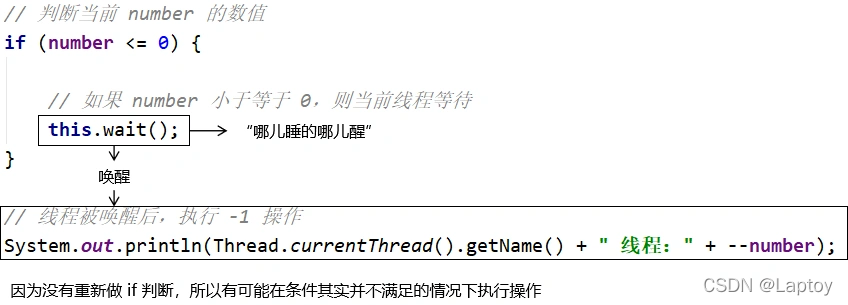

**解决：**使用 while 解决问题

> 要解决虚假唤醒问题，就需要对线程间通信时的判断条件使用 while 循环结构来执行，而不是 if 分支判断。

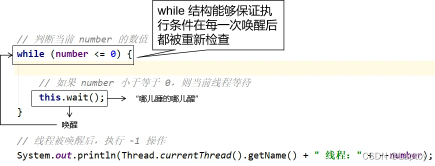


## 定制化通信

可以通过可重入锁的多种情况来达成，每把钥匙都对应同一把重入锁

```java
private Lock lock = new ReentrantLock();
//声明钥匙 A
private Condition conditionA = lock.newCondition();
//声明钥匙 B
private Condition conditionB = lock.newCondition();
//声明钥匙 C
private Condition conditionC = lock.newCondition();

```

```
conditionA.await();  //A等待
conditionA.signal(); //唤醒A
```

### 代码演示

- A 线程打印 5 次 A，B 线程打印 10 次 B，C 线程打印 15 次 C
- 按照此顺序循环 10 轮

```java
public class Laptoy {
    public static void main(String[] args) {
        Test test = new Test();

        new Thread(() -> {
            for (int i = 0; i < 10; i++) {
                try {
                    test.printA(i);
                } catch (Exception e) {
                    e.printStackTrace();
                }
            }
        }, "AA").start();

        new Thread(() -> {
            for (int i = 0; i < 10; i++) {
                try {
                    test.printB(i);
                } catch (Exception e) {
                    e.printStackTrace();
                }
            }
        }, "BB").start();

        new Thread(() -> {
            for (int i = 0; i < 10; i++) {
                try {
                    test.printC(i);
                } catch (Exception e) {
                    e.printStackTrace();
                }
            }
        }, "CC").start();


    }
}

class Test {
    //通信对象:0--打印 A 1---打印 B 2----打印 C
    private int number = 0;
    //声明锁
    private Lock lock = new ReentrantLock();
    //声明钥匙 A
    private Condition conditionA = lock.newCondition();
    //声明钥匙 B
    private Condition conditionB = lock.newCondition();
    //声明钥匙 C
    private Condition conditionC = lock.newCondition();

    /**
     * A 打印 5 次
     */
    public void printA(int j) {
        try {
            lock.lock();
            while (number != 0) {
                conditionA.await();
            }
            System.out.println(Thread.currentThread().getName() + "输出 A,第" + j + " 轮开始");
            //输出 5 次 A
            for (int i = 0; i < 5; i++) {
                System.out.println("A");
            }
            //开始打印 B
            number = 1;
            //唤醒 B
            conditionB.signal();
        } catch (Exception e) {
            e.printStackTrace();
        } finally {
            lock.unlock();
        }
    }

    /**
     * B 打印 10 次
     */
    public void printB(int j) {
        try {
            lock.lock();
            while (number != 1) {
                conditionB.await();
            }
            System.out.println(Thread.currentThread().getName() + "输出 B,第" + j + " 轮开始");
            //输出 10 次 B
            for (int i = 0; i < 10; i++) {
                System.out.println("B");
            }
            //开始打印 C
            number = 2;
            //唤醒 C
            conditionC.signal();
        } catch (Exception e) {
            e.printStackTrace();
        } finally {
            lock.unlock();
        }
    }

    /**
     * C 打印 15 次
     */
    public void printC(int j) {
        try {
            lock.lock();
            while (number != 2) {
                conditionC.await();
            }
            System.out.println(Thread.currentThread().getName() + "输出 C,第" + j + " 轮开始");
            //输出 15 次 C
            for (int i = 0; i < 15; i++) {
                System.out.println("C");
            }
            System.out.println("-----------------------------------------");
            //开始打印 A
            number = 0;
            //唤醒 A
            conditionA.signal();
        } catch (Exception e) {
            e.printStackTrace();
        } finally {
            lock.unlock();
        }
    }
}

```

# 集合的线程安全问题

## 解决ArrayList线程不安全

1. `Vector`

   ```java
   List<String> list = new Vector<>();
   ```

2. `Collections.synchronizedList`

   ```java
   List<String> list = Collections.synchronizedList(new ArrayList<>());
   ```

3. `CopyOnWriteArrayList`

   ```java
   List<String> list = new CopyOnWriteArrayList<>();
   ```

## 解决HashSet线程不安全

1. `Collections.synchronizedSet`

   ```java
   Set<String> set = Collections.synchronizedSet(new HashSet<>());
   ```

2. `CopyOnWriteArraySet`

   ```java
   Set<String> set = new CopyOnWriteArraySet<>();
   ```

## 解决HashMap线程不安全

1. `Hashtable`

   ```java
   Map<String, String> map = new Hashtable<>();
   ```

2. `Collections.synchronizedMap`

   ```java
   Map<String, String> map = Collections.synchronizedMap(new HashMap<>());
   ```

3. `ConcurrentHashMap`

   ```java
   Map<String, String> map = new ConcurrentHashMap<>();
   ```

# 辅助类

JUC 中提供了三种常用的辅助类，通过这些辅助类可以很好的解决线程数量过多时 Lock 锁的频繁操作带来的开销。

- CountDownLatch: 减少计数
- CyclicBarrier: 循环栅栏
- Semaphore: 信号灯

## CountDownLatch: 减少计数

**场景举例：**50 个同学离开教室再锁门

```java
import java.util.concurrent.CountDownLatch;

public class ClassroomLockExample {
    private static final int TOTAL_STUDENTS = 50;
    private static CountDownLatch latch = new CountDownLatch(TOTAL_STUDENTS);

    public static void main(String[] args) {
        // 假设这是教室监控系统
        Thread monitorThread = new Thread(() -> {
            try {
                latch.await(); // 监控系统等待所有学生离开
                System.out.println("All students have left the classroom. Locking the door.");
            } catch (InterruptedException e) {
                System.err.println("Monitor was interrupted while waiting for students to leave.");
            }
        }, "Classroom Monitor");

        monitorThread.start();

        // 启动50个学生线程代表每个学生离开教室的动作
        for (int i = 1; i <= TOTAL_STUDENTS; i++) {
            Thread studentThread = new Thread(() -> {
                System.out.println("Student " + i + " is leaving the classroom.");
                // 模拟学生离开教室的行为
                // ...

                // 离开教室后，计数器减一
                latch.countDown();
            }, "Student " + i);

            studentThread.start();
        }
    }
}
/*在这个例子中，CountDownLatch初始化为50，表示有50个同学。每当一个同学完成离开教室的动作，就调用一次countDown()方法减少计数器。当计数器减到0时，意味着所有同学都已经离开了教室，此时主线程（在这里表现为“监控系统”线程）的latch.await()会解除阻塞，然后可以执行锁门的操作。这样就能确保所有同学离开后再锁门。*/
```

## CyclicBarrier: 循环栅栏

**场景举例：**集齐 7 颗龙珠就可以召唤神龙

```java
import java.util.concurrent.BrokenBarrierException;
import java.util.concurrent.CyclicBarrier;

public class DragonBallCyclicBarrierExample {
    private static final int BALL_FINDER_COUNT = 7;
    private static final CyclicBarrier cyclicBarrier = new CyclicBarrier(BALL_FINDER_COUNT, () -> {
        System.out.println("All 7 Dragon Balls have been gathered by all finders! Summoning Shenron!");
        // ... 召唤神龙的逻辑
    });

    public static void main(String[] args) {
        // 创建七个寻找者线程
        for (int i = 1; i <= BALL_FINDER_COUNT; i++) {
            Thread finderThread = new Thread(() -> {
                System.out.println("Finder " + i + " started searching for a Dragon Ball.");
                // 模拟寻找龙珠的行为
                // ...

                System.out.println("Finder " + i + " found a Dragon Ball and is now heading to the meeting point.");
                
                try {
                    // 找到龙珠后，到达集合点
                    cyclicBarrier.await();
                } catch (InterruptedException | BrokenBarrierException e) {
                    System.err.println("Finder " + i + " encountered an error while waiting at the meeting point.");
                    e.printStackTrace();
                }
            }, "Finder " + i);

            finderThread.start();
        }
    }
}
/*在这个例子中，当七个寻找者线程全部调用cyclicBarrier.await()方法时，它们都会被阻塞，直到最后一个寻找者调用此方法。此时，CyclicBarrier的回调函数会被触发，表示所有寻找者已经成功汇集，然后一起召唤神龙。CyclicBarrier可以重复使用，也就是说在此次召唤神龙之后，还可以用于下一轮的龙珠收集和召唤。*/
```

## Semaphore: 信号灯

**场景举例：**10 辆车 3 个车位

```java
import java.util.concurrent.Semaphore;

public class ParkingLotExample {
    private static final int MAX_PARKING_SPOTS = 3;
    private static Semaphore parkingSpots = new Semaphore(MAX_PARKING_SPOTS);

    public static void main(String[] args) {
        // 假设有10辆车需要停车
        for (int i = 0; i < 10; i++) {
            new Thread(() -> {
                try {
                    // 请求一个停车位
                    parkingSpots.acquire();

                    System.out.println("Vehicle " + (i + 1) + " parked in the spot.");
                    // 模拟车辆停车的时间
                    Thread.sleep(1000);

                    System.out.println("Vehicle " + (i + 1) + " leaving the spot.");
                } catch (InterruptedException e) {
                    System.err.println("Vehicle interrupted while trying to park.");
                } finally {
                    // 无论是否发生异常，车辆离开后都要释放车位
                    parkingSpots.release();
                }
            }).start();
        }
    }
}
/*在这个例子中，Semaphore初始化为3，代表有3个车位。每辆车作为一个线程运行，当尝试获取一个车位（调用parkingSpots.acquire()）时，如果车位已满（即信号量的许可证为0），那么该线程将被阻塞直至有车离开并释放车位。当车辆离开时，会调用parkingSpots.release()释放车位，允许下一辆车停入。这样就能保证任何时候最多只有3辆车在车位上停放。*/
```

# 读写锁

## 概念

一个资源可以被多个读线程访问，也可以被一个写线程访问。但不能同时存在读写线程，读写互斥，读读共享。

- 读写锁：ReentrantReadWriteLock

  1、 读锁为ReentrantReadWriteLock.ReadLock，readLock()方法
  2、 写锁为ReentrantReadWriteLock.WriteLock，writeLock()方法

- 创建读写锁对象：`private ReadWriteLock rwLock = new ReentrantReadWriteLock();`

  1、写锁 加锁`rwLock.writeLock().lock();`
  2、写锁 解锁`rwLock.writeLock().unlock();`
  3、读锁 加锁`rwLock.readLock().lock();`
  4、读锁 解锁`rwLock.readLock().unlock();`

**代码演示：**

```java
import java.util.HashMap;
import java.util.Map;
import java.util.concurrent.TimeUnit;
import java.util.concurrent.locks.ReentrantReadWriteLock;

public class ReadWriteLockDemo {
    public static void main(String[] args) {
        MyCache myCache = new MyCache();

        // 写锁线程
        for (int i = 1; i <= 20; i++) {
            int num = i;
            new Thread(() -> {
                myCache.put(num + "", num + "");
            }, String.valueOf(i)).start();
        }

        // 读锁线程
        for (int i = 1; i <= 20; i++) {
            int num = i;
            new Thread(() -> {
                myCache.get(num + "");
            }, String.valueOf(i)).start();
        }
    }
}


class MyCache {

    ReentrantReadWriteLock readWriteLock = new ReentrantReadWriteLock();
    private volatile Map<String, Object> map = new HashMap<>();

    // 写数据
    public void put(String key, Object value) {
        // 写锁 加锁
        readWriteLock.writeLock().lock();
        try {
            System.out.println(Thread.currentThread().getName() + " 正在写操作" + key);
            // 模拟写操作花时
            TimeUnit.MICROSECONDS.sleep(300);
            
            map.put(key, value);
            System.out.println(Thread.currentThread().getName() + " 写完了" + key);
        } catch (InterruptedException e) {
            e.printStackTrace();
        } finally {
            // 写锁 解锁
            readWriteLock.writeLock().unlock();
        }
    }

    // 读数据
    public Object get(String key) {
        Object result = null;
        // 读锁 加锁
        readWriteLock.readLock().lock();
        try {
            System.out.println(Thread.currentThread().getName() + " 正在读操作" + key);
            TimeUnit.MICROSECONDS.sleep(300);
            result = map.get(key);
            System.out.println(Thread.currentThread().getName() + " 读完了" + key);
        } catch (InterruptedException e) {
            e.printStackTrace();
        } finally {
            // 读锁 解锁
            readWriteLock.readLock().unlock();
        }
        return result;
    }

}

```

## 锁的局限性

1. 无锁：多线程抢夺资源
2. synchronized和ReentrantLock：都是独占，每次只可以一个操作，不能共享
3. ReentrantReadWriteLock：读读可以共享，提升性能，但是不能多人写
4. 缺点：造成死锁（一直读，不能写），读进程不能写，写进程可以读。
5. 通过（写锁释放前可以读这一特性）进行锁降级，可以提高效率

## 写锁的锁降级

1. 目的： 写锁降级为读锁（一般等级写锁高于读锁）（利用写锁时可以读这一特性）
2. 正常情况是获取写锁，释放写锁，获取读锁，释放读锁
3. 降级流程：获取写锁->获取读锁->释放写锁->释放读锁--->**其实就是在写锁释放前进行获取读锁，可以提高线程效率**

**代码演示：**

```java
public class Demo1 {

    public static void main(String[] args) {
        //可重入读写锁对象
        ReentrantReadWriteLock rwLock = new ReentrantReadWriteLock();
        ReentrantReadWriteLock.ReadLock readLock = rwLock.readLock();//读锁
        ReentrantReadWriteLock.WriteLock writeLock = rwLock.writeLock();//写锁

        //锁降级
        //1 获取写锁
        writeLock.lock();
        System.out.println("laptoy");
        
        //2 获取读锁
        readLock.lock();
        System.out.println("---read---");
        
        //3 释放写锁
        writeLock.unlock();

        //4 释放读锁
        readLock.unlock();
    }
}

```

# Java中各种锁的理解


## 公平锁与非公平锁

**公平锁：**多个线程按照申请锁的顺序去获得锁，线程会直接进入队列去排队，永远都是队列的第一位才能得到锁。

- 优点：所有的线程都能得到资源，不会饿死在队列中。
- 缺点：吞吐量会下降很多，队列里面除了第一个线程，其他的线程都会阻塞，cpu唤醒阻塞线程的开销会很大。

**非公平锁：**多个线程去获取锁的时候，会直接去尝试获取，获取不到，再去进入等待队列，如果能获取到，就直接获取到锁。

- 优点：可以减少CPU唤醒线程的开销，整体的吞吐效率会高点，CPU也不必唤醒所有线程，会减少唤起线程的数量。

- 缺点：可能导致队列中间的线程一直获取不到锁或者长时间获取不到锁，导致饿死。

**创建可重入锁的时候可以设置公平或非公平锁（默认是非公平锁 ）**

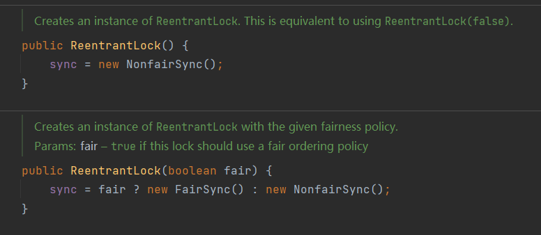

## 可重入锁

- synchronized：隐式，自动获取释放锁
- Lock：显式，手动获取释放锁

### synchronized演示可重入锁

**1、拿到外层的锁就可以拿到内层的锁**

```java
public class SyncLock {
    public static void main(String[] args) {

        Object o = new Object();

        new Thread(() -> {
            synchronized (o) {
                System.out.println(Thread.currentThread().getName() + "外层锁");
                
                synchronized (o) {
                    System.out.println(Thread.currentThread().getName() + "中层锁");
                    
                    synchronized (o) {
                        System.out.println(Thread.currentThread().getName() + "内层锁");
                    }
                }
            }
        }, "laptoy-t").start();
    }

}

// laptoy-t外层锁
// laptoy-t中层锁
// laptoy-t内层锁

```

**2、递归锁**

```java
public class SyncLock {
    public static void main(String[] args) {
        new SyncLock().add();
    }

    synchronized void add() {
        add();
    }
}

// 栈溢出异常，证明可重入锁可以递归调用

```

### Lock演示可重入锁

```java
public class SyncLock {
    public static void main(String[] args) {
        
        Lock lock = new ReentrantLock();

        new Thread(() -> {
            try {
                lock.lock();
                System.out.println(Thread.currentThread().getName() + "外层锁");

                try {
                    lock.lock();
                    System.out.println(Thread.currentThread().getName() + "内层锁");
                } finally {
                    lock.unlock();
                }

            } finally {
                lock.unlock();
            }
        }, "laptoy-t").start();
    }
}

// laptoy-t外层锁
// laptoy-t内层锁

```

## 死锁

两个或两个以上进程执行过程中，因为争夺资源而造成的一种互相等待的现象，如果没有外力干涉，他们无法再执行下去。

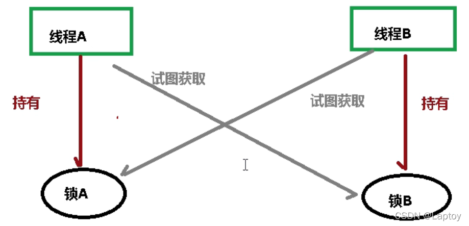

### 快速演示死锁代码

```java
package com.walle.javaConcurrent.deadLock;

public class DeadLock {

    static Object a = new Object();
    static Object b = new Object();

    public static void main(String[] args) {
        new Thread(() -> {
            synchronized (a) {
                System.out.println(Thread.currentThread().getName() + "线程 持有锁a，试图获取锁b");
                try {
                    Thread.sleep(1000);
                } catch (InterruptedException e) {
                    e.printStackTrace();
                }
                synchronized (b) {
                    System.out.println(Thread.currentThread().getName() + "线程 获取锁b");
                }
            }
        }, "A").start();

        new Thread(() -> {
            synchronized (b) {
                System.out.println(Thread.currentThread().getName() + "线程 持有锁b，试图获取锁b");
                synchronized (a) {
                    System.out.println(Thread.currentThread().getName() + "线程 获取锁a");
                }
            }
        }, "B").start();
    }

}
// A线程 持有锁a，试图获取锁b
// B线程 持有锁b，试图获取锁b

```

### 验证死锁

执行`jps`查询正在执行的进程

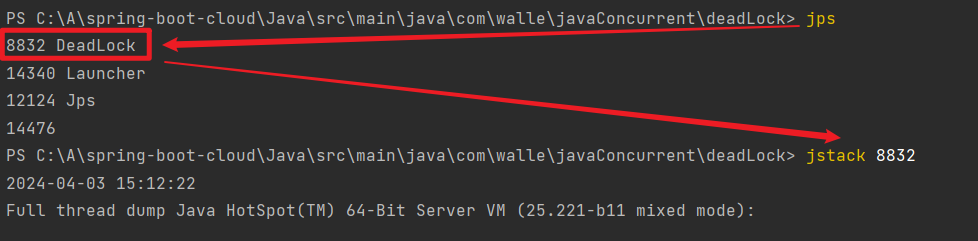

执行`jstack 8832`追踪堆栈

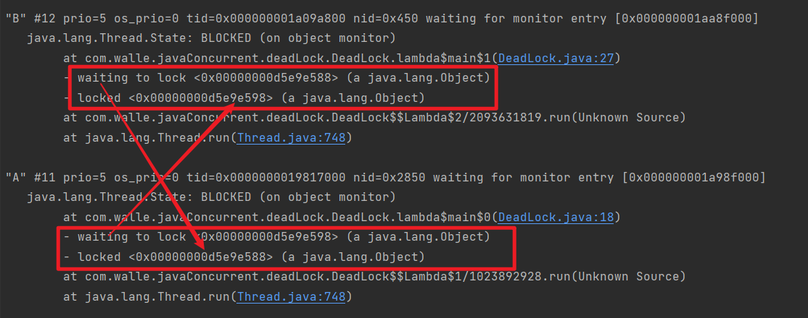

### 排查死锁（工作中）

- 日志信息90%
- 堆栈信息10%

# 阻塞队列

## 概念

- 阻塞队列是共享队列（多线程操作），一端输入，一端输
- 所谓阻塞，在某些情况下会挂起线程（即阻塞），一旦条件满足，被挂起的线程又会自动被唤起

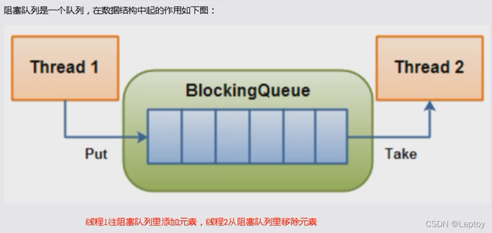

## 执行流程

- 当队列是空的，从队列中获取元素的操作将会被阻塞
- 当队列是满的，从队列中添加元素的操作将会被阻塞
- 试图从空的队列中获取元素的线程将会被阻塞，直到其他线程往空的队列插入新的元素
- 试图向已满的队列中添加新元素的线程将会被阻塞，直到其他线程从队列中移除一个或多个元素或者完全清空，使队列变得空闲起来并后续新增

## 举个例子

通过队列可以很便利地实现两者之间的数据共享。假设我们有若干生产者线程，另外又有若干个消费者线程。如果生产者线程需要把准备好的数据共享给消费者线程，利用队列的方式来传递数据，就可以很方便地解决他们之间的数据共享问题。但如果生产者和消费者在某个时间段内，万一发生数据处理速度不匹配的情况呢？理想情况下，如果生产者产出数据的速度大于消费者消费的速度，并且当生产出来的数据累积到一定程度的时候，那么生产者必须暂停等待一下（阻塞生产者线程），以便等待消费者线程把累积的数据处理完毕，反之亦然

- 当队列中没有数据的情况下，消费者端的所有线程都会被自动阻塞（挂起），直到有数据放入队列
- 当队列中填满数据的情况下，生产者端的所有线程都会被自动阻塞（挂起），直到队列中有空的位置，线程被自动唤醒

## 种类

**常用的阻塞队列：**

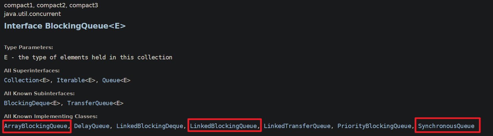

1. ArrayBlockingQueue（数组有界阻塞队列）

   生产者和消费者共用同一个锁，无法并行

2. LinkedBlockingQueue（链表有界阻塞队列），默认值为integer.MAX_VALUE

   生产者和消费者采用了独立的锁，可以并行

3. SynchronousQueue

   一个不存储元素的阻塞队列，消费者线程调用 take() 方法的时候就会发生阻塞，直到有一个生产者线程生产了一个元素，消费者线程就可以拿到这个元素并返回；生产者线程调用 put() 方法的时候也会发生阻塞，直到有一个消费者线程消费了一个元素，生产者才会返回。


## 方法

| 方法类型     | 抛出异常  | 特殊值   | 阻塞   | 超时               |
| ------------ | --------- | -------- | ------ | ------------------ |
| 插入元素     | add(e)    | offer(e) | put(e) | offer(e,time,unit) |
| 移除元素     | remove()  | poll()   | take() | poll(time,unit)    |
| 获取首部元素 | element() | peek()   | 不可用 | 不可用             |

**抛出异常**

- 当队列满再add()会抛出IllegalStateException：Queue full
- 当队列空再remove()会抛NoSuchElementException

**特殊值**

- 插入成功true，失败false
- 移除成功返回出队列的元素，失败返回null

**阻塞**

- 队列满继续put会阻塞直到put成功或响应中断退出
- 队列空继续take会阻塞直到take成功

**超时退出**

- 阻塞队列满时，队列阻塞生产者一定时间，超时后生产者线程退出

## 代码演示

1. **抛出异常演示**

   ```java
   public class BlockingQueueDemo {
       public static void main(String[] args) {
           ArrayBlockingQueue<Object> blockingQueue = new ArrayBlockingQueue<>(3);
   
           System.out.println(blockingQueue.add("a")); // true
           System.out.println(blockingQueue.add("b")); // true
           System.out.println(blockingQueue.add("c")); // true
   
         //System.out.println(blockingQueue.add("d")); // 抛异常
         
           System.out.println(blockingQueue.element());// a，检查出即将出队列的元素
   
           System.out.println(blockingQueue.remove()); // a
           System.out.println(blockingQueue.remove()); // b
           System.out.println(blockingQueue.remove()); // c
           
         //System.out.println(blockingQueue.remove()); //抛异常
       }
   }
   
   ```

2. **特殊值演示**

   ```java
   public class BlockingQueueDemo {
       public static void main(String[] args) {
           ArrayBlockingQueue<Object> blockingQueue = new ArrayBlockingQueue<>(3);
   
           System.out.println(blockingQueue.offer("a")); // true
           System.out.println(blockingQueue.offer("b")); // true
           System.out.println(blockingQueue.offer("c")); // true
           System.out.println(blockingQueue.offer("d")); // false
   
           System.out.println(blockingQueue.peek());     // a，检查出即将出队列的元素
   
           System.out.println(blockingQueue.poll()); // a
           System.out.println(blockingQueue.poll()); // b
           System.out.println(blockingQueue.poll()); // c
           System.out.println(blockingQueue.poll()); // null
       }
   }
   
   ```

3. **阻塞演示**

   ```java
   public class BlockingQueueDemo {
       public static void main(String[] args) throws InterruptedException {
           ArrayBlockingQueue<Object> blockingQueue = new ArrayBlockingQueue<>(3);
   
           blockingQueue.put("a");
           blockingQueue.put("b");
           blockingQueue.put("c");
           // blockingQueue.put("d"); //阻塞
   
           System.out.println(blockingQueue.take()); // a
           System.out.println(blockingQueue.take()); // b
           System.out.println(blockingQueue.take()); // c
           // System.out.println(blockingQueue.take()); // 阻塞
   
       }
   }
   
   ```

4. **超时演示**

   ```java
   public class BlockingQueueDemo {
       public static void main(String[] args) throws InterruptedException {
           ArrayBlockingQueue<Object> blockingQueue = new ArrayBlockingQueue<>(3);
   
           System.out.println(blockingQueue.offer("a", 3L, TimeUnit.SECONDS)); // true
           System.out.println(blockingQueue.offer("b", 3L, TimeUnit.SECONDS)); // true
           System.out.println(blockingQueue.offer("c", 3L, TimeUnit.SECONDS)); // true
           System.out.println(blockingQueue.offer("d", 3L, TimeUnit.SECONDS)); // false，阻塞三秒后返回false
   
           System.out.println(blockingQueue.poll(3L, TimeUnit.SECONDS)); // a
           System.out.println(blockingQueue.poll(3L, TimeUnit.SECONDS)); // b
           System.out.println(blockingQueue.poll(3L, TimeUnit.SECONDS)); // c
           System.out.println(blockingQueue.poll(3L, TimeUnit.SECONDS)); // null，阻塞三秒后返回null
       }
   }
   
   ```

# 线程池

- **三大方式**
- **七大参数**
- **四种拒绝策略**

## 概念

- 一种线程使用模式。线程过多会带来调度开销，进而影响缓存局部性和整体性能。而线程池维护着多个线程，等待着监督管理者分配可并发执行的任务。这避免了在处理短时间任务时创建与销毁线程的代价。线程池不仅能够保证内核的充分利用，还能防止过分调度。

- 线程池做的工作只要是控制运行的线程数量，处理过程中将任务放入队列，然后在线程创建后启动这些任务，如果线程数量超过了最大数量，超出数量的线程排队等候，等其他线程执行完毕，再从队列中取出任务来执行。

## 特点

- **降低资源消耗**：通过重复利用已创建的线程降低线程创建和销毁造成的销耗。
- **提高响应速度**：当任务到达时，任务可以不需要等待线程创建就能立即执行。
- **提高线程的可管理性**：线程是稀缺资源，如果无限制的创建，不仅会销耗系统资源，还会降低系统的稳定性，使用线程池可以进行统一的分配，调优和监控。

## 继承图

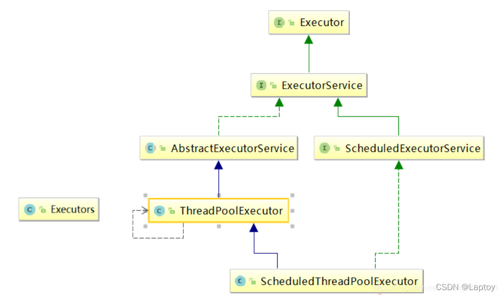

Executors帮我们封装好的线程池，拿来即用

- Executors.newFixedThreadPool(5)：一池5线程（定长线程池）
- Executors.newCachedThreadPool()：自动分配线程数量（可缓存线程池）
- Executors.newSingleThreadExecutor()： 一池一线程（单线程化线程池）

```java
public class Demo01 {
    public static void main(String[] args) {
        // 一池5线程
        ExecutorService pool1 = Executors.newFixedThreadPool(5);
        // 自动分配多少线程
        ExecutorService pool2 = Executors.newCachedThreadPool();
        // 一池一线程
        ExecutorService pool3 = Executors.newSingleThreadExecutor();

        try {
            for (int i = 0; i <= 10; i++) {
                pool1.execute(() -> {
                    System.out.println(Thread.currentThread().getName() + " 执行成功");
                });
            }
        } catch (Exception e) {
            e.printStackTrace();
        } finally {
            pool1.shutdown();
        }
    }
}

// 以一池5线程演示结果
// pool-1-thread-2 执行成功
// pool-1-thread-4 执行成功
// pool-1-thread-1 执行成功
// pool-1-thread-3 执行成功
// pool-1-thread-1 执行成功
// pool-1-thread-4 执行成功
// pool-1-thread-2 执行成功
// pool-1-thread-5 执行成功
// pool-1-thread-4 执行成功
// pool-1-thread-1 执行成功
// pool-1-thread-3 执行成功
```

## 底层都是`new ThreadPoolExecutor`

```java
public static ExecutorService newFixedThreadPool(int nThreads) {
    return new ThreadPoolExecutor(nThreads, nThreads,
                                  0L, TimeUnit.MILLISECONDS,
                                  new LinkedBlockingQueue<Runnable>());
}

public static ExecutorService newCachedThreadPool() {
    return new ThreadPoolExecutor(0, Integer.MAX_VALUE,
                                  60L, TimeUnit.SECONDS,
                                  new SynchronousQueue<Runnable>());
}

public static ExecutorService newSingleThreadExecutor() {
    return new FinalizableDelegatedExecutorService
        (new ThreadPoolExecutor(1, 1,
                                0L, TimeUnit.MILLISECONDS,
                                new LinkedBlockingQueue<Runnable>()));
}

```

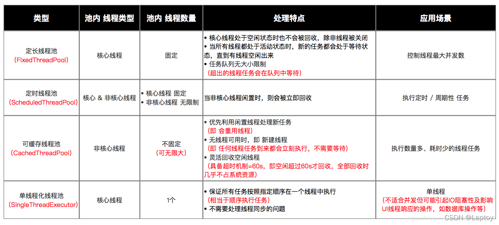

## ThreadPoolExecutor的七个参数

```java
public ThreadPoolExecutor(int corePoolSize,
                          int maximumPoolSize,
                          long keepAliveTime,
                          TimeUnit unit,
                          BlockingQueue<Runnable> workQueue,
                          ThreadFactory threadFactory,
                          RejectedExecutionHandler handler) {
    if (corePoolSize < 0 ||
        maximumPoolSize <= 0 ||
        maximumPoolSize < corePoolSize ||
        keepAliveTime < 0)
        throw new IllegalArgumentException();
    if (workQueue == null || threadFactory == null || handler == null)
        throw new NullPointerException();
    this.corePoolSize = corePoolSize;
    this.maximumPoolSize = maximumPoolSize;
    this.workQueue = workQueue;
    this.keepAliveTime = unit.toNanos(keepAliveTime);
    this.threadFactory = threadFactory;
    this.handler = handler;
}

```

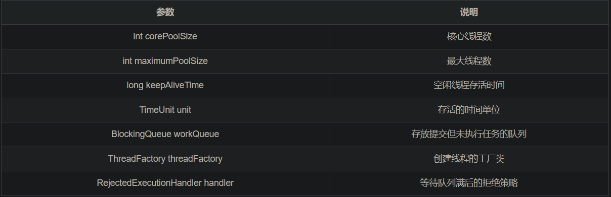

## 执行流程

建线程池时不会创建线程，执行`run()`才会进行`execute()`创建

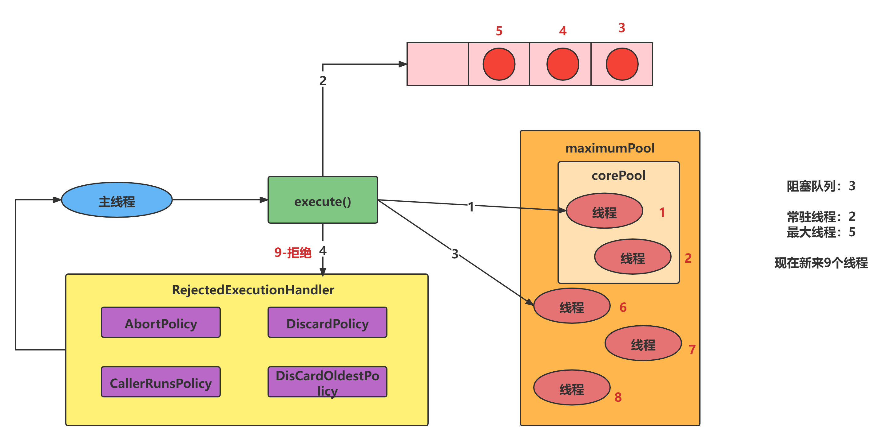

假设最大线程数为5，核心线程为2，阻塞队列为3，现在进来9个线程

- 进来2个线程，调用线程池核心线程执行 （1 2）
- 继续来三个线程（超过核心线程数），这三个就进入阻塞队列 （3 4 5）
- 继续来三个线程（超过阻塞队列但未超过最大线程数），这三个线程会直接优先创建 （6 7 8）
- 继续来线程（超过最大线程数），会通过拒绝策略进行拒绝 （9 ...）

## 拒绝策略(handler)

- AbortPolicy(默认)：丢弃任务，并抛出拒绝执行 RejectedExecutionException
- CallerRunsPolicy：不会丢弃任务，也不会抛出异常，将任务返还给调用者执行
- DiscardPolicy：直接丢弃
- DiscardOldestPolicy：抛弃阻塞队列等待时间最久的任务，把当前任务加入队列中尝试再次提交当前任务

## 线程工厂

线程工厂指定创建线程的方式，需要实现 ThreadFactory 接口，并实现 newThread(Runnable r) 方法。该参数可以不用指定，Executors 框架已经为我们实现了一个默认的线程工厂：

```java
/**
 * The default thread factory.
 */
private static class DefaultThreadFactory implements ThreadFactory {
    private static final AtomicInteger poolNumber = new AtomicInteger(1);
    private final ThreadGroup group;
    private final AtomicInteger threadNumber = new AtomicInteger(1);
    private final String namePrefix;
 
    DefaultThreadFactory() {
        SecurityManager s = System.getSecurityManager();
        group = (s != null) ? s.getThreadGroup() :
                              Thread.currentThread().getThreadGroup();
        namePrefix = "pool-" +
                      poolNumber.getAndIncrement() +
                     "-thread-";
    }
 
    public Thread newThread(Runnable r) {
        Thread t = new Thread(group, r,
                              namePrefix + threadNumber.getAndIncrement(),
                              0);
        if (t.isDaemon())
            t.setDaemon(false);
        if (t.getPriority() != Thread.NORM_PRIORITY)
            t.setPriority(Thread.NORM_PRIORITY);
        return t;
    }
}

```


## 自定义线程池

不推荐直接使用功能线程池创建，而是通过ThreadPoolExecutor的方式传递参数创建

```java
public class Demo01 {
    public static void main(String[] args) {
        ThreadPoolExecutor threadPool = new ThreadPoolExecutor(
        		2, 
        		5, 
        		2L,
                TimeUnit.SECONDS,
                new ArrayBlockingQueue<>(3),
                Executors.defaultThreadFactory(),
                new ThreadPoolExecutor.AbortPolicy());

        try {
            for (int i = 0; i <= 10; i++) {
                threadPool.execute(() -> {
                    System.out.println(Thread.currentThread().getName() + " 执行成功");
                });
            }
        } catch (Exception e) {
            e.printStackTrace();
        } finally {
            threadPool.shutdown();
        }

    }
}


```

# Fork/Join

## 概念

在JDK1.7出现，Fork/Join 它可以将一个大的任务拆分成多个子任务进行并行处理，最后将子任务结果合并成最后的计算结果，并进行输出。Fork/Join 框架要完成两件事情：

- Fork：把一个复杂任务进行分拆，大事化小
- Join：把分拆任务的结果进行合并

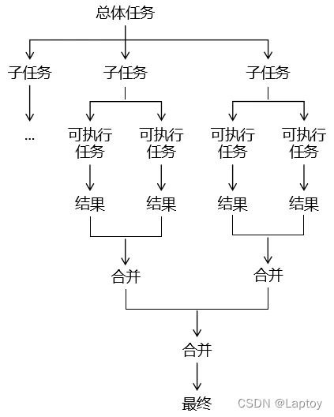

- 任务分割：首先 Fork/Join 框架需要把大的任务分割成足够小的子任务，如果子任务比较大的话还要对子任务进行继续分割
- 执行任务并合并结果：分割的子任务分别放到双端队列里，然后几个启动线程分别从双端队列里获取任务执行。子任务执行完的结果都放在另外一个队列里，启动一个线程从队列里取数据，然后合并这些数据。

## API介绍

### RecursiveTask

用于有返回结果的任务

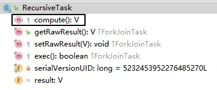


我们使用 Fork Join 框架只需要继承 RecursiveTask，然后重写 compute() 方法即可。在 compute() 方法中需要包含：

- 任务拆分的逻辑
- 任务拆分的操作：调用 fork() 方法
- 已拆分任务的合并：调用 join() 方法
- 子任务结果的合并：将 join() 方法的返回值合并起来

### ForkJoinTask

RecursiveTask的父类

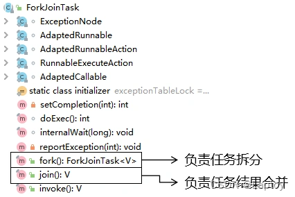

## 代码演示

**1、需求**

完成从 1~100 的累加

**2、思路**

通过任务拆分、合并的方式来实现。拆分的逻辑是：

- 将大范围数值累加拆分为小范围数值累加。
- 在 1~10 区间范围内执行计算。

```java
public class Demo01 {
    public static void main(String[] args) throws ExecutionException, InterruptedException {
        // 1、创建 Fork Join 任务池
        ForkJoinPool pool = new ForkJoinPool();
        // 2、创建任务对象
        MyTask myTask = new MyTask(1, 100);
        // 3、将任务对象提交到任务池
        ForkJoinTask<Integer> forkJoinTask = pool.submit(myTask);
        // 4、获取任务执行结果
        int finalResult = forkJoinTask.get();
        System.out.println("finalResult = " + finalResult);
        // 5、关闭池
        pool.shutdown();
    }
}

class MyTask extends RecursiveTask<Integer> {

    // 区间开始位置
    private final int begin;

    // 区间结束位置
    private final int end;

    // 区间调整值：要通过拆分任务将区间调整到 10 以内
    public static final int ADJUST_VALUE = 10;

    // 保存当前任务的结果
    private int result = 0;

    // 声明构造器，设定当前任务的开始和结束位置
    public MyTask(int begin, int end) {
        this.begin = begin;
        this.end = end;
    }

    @Override
    protected Integer compute() {

        // 1、判断当前区间是否是原子任务中可以执行计算的范围
        if (end - begin <= ADJUST_VALUE) {
            for (int i = begin; i <= end; i++) {
                result = result + i;
            }
        } else {
            // 2、计算新拆分任务的区间范围
            int leftEnd = (begin + end) / 2;

            int rightBegin = leftEnd + 1;

            // 3、创建两个新的任务（子任务）
            MyTask myTaskLeft = new MyTask(begin, leftEnd);
            MyTask myTaskRight = new MyTask(rightBegin, end);

            // 4、调用框架提供的 fork() 进一步拆分任务
            myTaskLeft.fork();
            myTaskRight.fork();

            // 5、调用框架提供的 join() 获取子任务计算的结果
            int leftResult = myTaskLeft.join();
            int rightResult = myTaskRight.join();

            // 6、把子任务的结果合并到一起
            result = leftResult + rightResult;
        }

        return result;
    }

}

```

# 异步回调 CompletableFutur

## 简介

- CompletableFuture 就是 Callable + FutureTask 组合的『超级强化版』

- FutureTask 的核心接口 Futrue 通常用来表示一个异步任务的引用，比如我们将任务提交到线程池里面，然后我们会得到一个 Futrue 对象。在 Future 里面有 isDone() 方法来判断任务是否处理结束，还有 get() 方法可以一直阻塞直到任务结束然后获取结果。但整体来说这种方式，还是同步的，因为需要客户端不断阻塞等待或者不断轮询才能知道任务是否完成。

Future 的主要缺点如下：

1. 不支持手动完成
   我提交了一个任务，但是执行太慢了，我通过其他路径已经获取到了任务结果，现在没法把这个任务结果通知到正在执行的线程，所以必须主动取消或者一直等待它执行完成

2. 不支持进一步的非阻塞调用
   通过Future的get方法会一直阻塞到任务完成，但是想在获取任务之后执行额外的任务，因为Future不支持回调函数，所以无法实现这个功能

3. 不支持链式调用
   对于 Future 的执行结果，我们想继续传到下一个 Future 处理使用，从而形成一个链式的 pipeline 调用，这在Future 中是没法实现的。

4. 不支持多个 Future 合并
   比如我们有 10 个 Future 并行执行，我们想在所有的Future运行完毕之后，执行某些函数，是没法通过 Future 实现的。

5. 不支持异常处理
   Future 的 API 没有任何的异常处理的 api，所以在异步运行时，如果出了问题是不好定位的。

## 用法

1、执行无返回值任务

```java
public class Demo01 {
    public static void main(String[] args) throws ExecutionException, InterruptedException {
        CompletableFuture<Void> voidCompletableFuture = CompletableFuture.runAsync(() -> {
            System.out.println(Thread.currentThread().getName() + "completableFuture1");
        });
        voidCompletableFuture.get();
	
    }
}

```

2、执行有返回值任务

```java
public class Demo01 {
    public static void main(String[] args) {
        CompletableFuture<Integer> completableFuture = CompletableFuture.supplyAsync(() -> {
            System.out.println(Thread.currentThread().getName() + "completableFuture2");
            int i = 1 / 0;
            return 1024;
        });
        
        completableFuture.whenComplete((t, u) -> {
            System.out.println("t:" + t);
            System.out.println("u:" + u);
        });

    }
}


```

# stream流式计算

## 四大函数式接口

**Java**内置四大核心函数式接口

| 函数式接口               | 参数类型 | 返回类型 | 接口方法                                                     |
| :----------------------- | :------: | :------: | :----------------------------------------------------------- |
| Consumer<T> 消费型接口   |    T     |   void   | 对类型为T的对象应用操作，包含方法：void accept(T t)          |
| Supplier<T> 供给型接口   |    无    |    T     | 返回类型为T的对象，包含方法：T get();                        |
| Function<T,R> 函数型接口 |    T     |    R     | 对类型为T的对象应用操作，并返回结果。结果是R类型的对象。包含方法：R apply(T t); |
| Predicate<T> 断定型接口  |    T     | boolean  | 确定类型为T的对象是否满足某约束，并返回boolean值。包含方法：boolean test(T t); |

## 代码举例

- 我们以一个简单的数组求和作为例子
- 三六九等：三（普通方法） 六（ForkJoin） 九（Stream并行流）

1. 普通方法（顺序执行）：

```java
public class SumArrayExample {
    public static void main(String[] args) {
        SumArray sumArray = new SumArray();
        int[] numbers = {1, 2, 3, 4, 5, 6, 7, 8, 9};
        long startTime = System.nanoTime();
        int sum = sumArray.sumSequentially(numbers);
        long endTime = System.nanoTime();
        System.out.println("Sequential sum: " + sum);
        System.out.println("Sequential execution time: " + ((endTime - startTime) / 1_000_000) + "ms");
    }

    public int sumSequentially(int[] array) {
        int sum = 0;
        for (int number : array) {
            sum += number;
        }
        return sum;
    }
}
```

2. 使用Fork/Join框架进行并行计算：

```java
import java.util.concurrent.ForkJoinPool;
import java.util.concurrent.RecursiveTask;

public class SumArrayExample {
    public static void main(String[] args) {
        SumArray sumArray = new SumArray();
        int[] numbers = {1, 2, 3, 4, 5, 6, 7, 8, 9};
        ForkJoinPool forkJoinPool = new ForkJoinPool();
        long startTime = System.nanoTime();
        int sum = forkJoinPool.invoke(sumArray.new ParallelSumTask(numbers, 0, numbers.length));
        long endTime = System.nanoTime();
        System.out.println("Parallel sum: " + sum);
        System.out.println("Parallel execution time using Fork/Join: " + ((endTime - startTime) / 1_000_000) + "ms");
    }

    public class ParallelSumTask extends RecursiveTask<Integer> {
        private final int[] array;
        private final int start;
        private final int end;

        public ParallelSumTask(int[] array, int start, int end) {
            this.array = array;
            this.start = start;
            this.end = end;
        }

        @Override
        protected Integer compute() {
            if (end - start <= 1) {
                return array[start];
            } else {
                int middle = (start + end) / 2;
                ParallelSumTask leftTask = new ParallelSumTask(array, start, middle);
                ParallelSumTask rightTask = new ParallelSumTask(array, middle, end);
                invokeAll(leftTask, rightTask);
                return leftTask.join() + rightTask.join();
            }
        }
    }
}
```

3. 使用Java Stream并行流：

```java
public class SumArrayExample {
    public static void main(String[] args) {
        SumArray sumArray = new SumArray();
        int[] numbers = {1, 2, 3, 4, 5, 6, 7, 8, 9};
        long startTime = System.nanoTime();
        int sum = Arrays.stream(numbers)
                        .parallel()
                        .sum();
        long endTime = System.nanoTime();
        System.out.println("Parallel sum using Java Stream: " + sum);
        System.out.println("Parallel execution time using Java Stream: " + ((endTime - startTime) / 1_000_000) + "ms");
    }
}
```


> 引用：
>
> - 学习JUC高并发编程这一篇就够了（上篇）https://blog.csdn.net/apple_53947466/article/details/123656594
> - 学习JUC高并发编程这一篇就够了（下篇）https://blog.csdn.net/apple_53947466/article/details/123664861
> - JUC基础【万字篇】https://blog.csdn.net/qq_43417581/article/details/127217919
