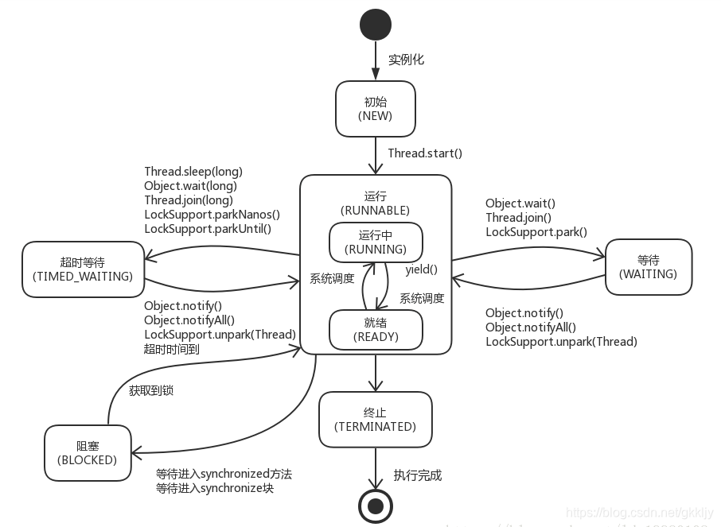

# 一、进程、线程、协程、同步、异步、阻塞、非阻塞、并发、并行、串行

1. **进程**：
   - 进程是操作系统中资源分配和调度的基本单位，代表着系统中运行的一个程序实例。
   - 每个进程都有独立的内存空间和其他系统资源。
   - 不同的进程之间相互隔离，通过进程间通信（IPC）机制进行信息交互。
2. **线程**：
   - 线程是操作系统能够进行运算调度的最小单位，它被包含在进程之中，是进程内部的一个独立执行流。
   - 一个进程中可以包含多个线程。这些线程共享进程的内存空间和其他资源，因此创建和切换线程的开销小于进程。
   - 多线程可以实现进程内部的并发执行，提高CPU利用率。
3. **协程**：
   - 协程是一种用户态的轻量级线程实现，也称作协作式多任务。
   - 它不同于操作系统调度的线程，协程的调度完全由用户程序控制。
   - 协程可以在函数调用时保存上下文并在适当时候恢复执行，允许在单个线程中模拟出多任务效果，且没有线程切换的开销。
4. **同步**：
   - 同步指的是一个操作完成后才会执行下一个操作。
   - 比如在编程中调用一个函数，直到该函数返回结果后，后续代码才会继续执行。
   - 同步执行不会立即返回控制权，而是等待任务完成。
5. **异步**：
   - 异步则是指发起一个操作后，无需等待该操作完成即可继续执行后续代码。
   - 操作结果通过回调，或者通过事件等机制通知调用者。
   - 这种模式下，程序不会阻塞等待某个操作结束，即调用发出后不必等待响应就可以去做别的事情。
6. **阻塞**：
   - 阻塞是指在执行某个操作（如I/O请求）时，调用线程或进程会暂停执行，直到该操作完成。
   - 在此期间，操作系统可能将CPU时间片分配给其他可执行的线程或进程。
7. **非阻塞**：
   - 非阻塞操作则是指调用发出后，调用者不会被挂起，而是立即返回一个状态（如“未准备好”）。
   - 然后调用者可以选择轮询检查操作是否完成，或者通过事件通知机制得知操作完成。
8. **并发**：
   - 并发是指在一段时间内多个任务交替执行，从宏观上看似乎同时发生，但实际上由于CPU时间片轮转，微观上并非真正的同时执行。
   - 并发强调的是多个任务在执行时间上的重叠。
9. **并行**：
   - 并行指两个或多个任务在同一时刻真正地同时执行，尤其在多核或多处理器环境中，每个核心可以独立执行任务，实现物理上的同时处理。
   - 并行强调的是在硬件层面上的真正同时执行。
10. **串行**：
    - 串行是指任务按照严格的顺序执行，一个任务执行完毕后下一个任务才能开始。
    - 在单核系统中，如果没有并发机制的话，所有任务只能串行执行。
    - 即使在多核系统中，若没有充分利用多核特性，也可能表现为串行执行。

# 二、创建线程的方式

Java实现多线程的方式主要有以下4种：

1. **继承Thread类** 
2. **实现Runnable接口**
3. **实现Callable接口** 
4. **开启线程池**

代码示例：

**继承Thread类**

```java
public class MyThread extends Thread {
    @Override
    public void run() {
        // 任务代码
        System.out.println("线程 " + Thread.currentThread().getName() + " 正在运行...");
    }

    public static void main(String[] args) {
        MyThread thread = new MyThread();
        thread.start(); // 启动线程
    }
}
```

**实现Runnable接口**

```java
public class RunnableExample implements Runnable {
    @Override
    public void run() {
        // 任务代码
        System.out.println("线程 " + Thread.currentThread().getName() + " 正在运行...");
    }

    public static void main(String[] args) {
        Runnable task = new RunnableExample();
        Thread thread = new Thread(task);
        thread.start();
    }
}
```

**实现Callable接口** 

```java
public class CallableExample implements Callable<String> {
    @Override
    public String call() throws Exception {
        // 任务代码，可以有返回值
        System.out.println("线程 " + Thread.currentThread().getName() + " 正在运行...");
        return "Callable任务已完成";
    }

    public static void main(String[] args) throws InterruptedException, ExecutionException {
        Callable<String> callable = new CallableExample();
        FutureTask<String> futureTask = new FutureTask<>(callable);
        Thread thread = new Thread(futureTask);
        thread.start();

        // 获取Callable任务的结果
        String result = futureTask.get();
        System.out.println("任务结果：" + result);
    }
}
```

**开启线程池**

```java
public class ThreadPoolExample implements Runnable {
    @Override
    public void run() {
        // 任务代码
        System.out.println("线程 " + Thread.currentThread().getName() + " 正在运行...");
    }

    public static void main(String[] args) {
        // 创建固定大小的线程池
        ExecutorService executorService = Executors.newFixedThreadPool(5);

        // 提交任务
        for (int i = 0; i < 5; i++) {
            executorService.submit(new ThreadPoolExample());
        }

        // 关闭线程池
        executorService.shutdown();
    }
}
```

# 三、线程的生命周期

**线程的状态：**

```java
/**
 * Thread.java源码中State枚举定义了线程可能处于的不同状态。
 */
public enum State {
    
        NEW,

        RUNNABLE,

        BLOCKED,

        WAITING,

        TIMED_WAITING,

        TERMINATED;
    }
```

**线程的生命周期：**



1. **新建状态（NEW）** 

   当一个 Thread 对象被创建但尚未调用其 start() 方法时，线程处于新建状态。

   此时线程对象已存在，但并没有分配到任何操作系统资源，也没有开始执行。 

2. **可运行状态（RUNNABLE）**

   包括了两个子状态： 从Java的角度看，RUNNABLE状态包括了READY和RUNNING两种实际的操作系统状态。

   i. 就绪状态（READY）: 

   线程已经调用了 start() 方法，且线程调度器随时可以将其分配给CPU进行执行。

   线程在就绪队列中等待，一旦得到CPU时间片，它就转为运行状态。

   ii. 运行状态（RUNNING）: 

   线程正在执行其 run() 方法。

3. **阻塞状态（BLOCKED）** 

   线程试图获取一个监视器锁（synchronized块或方法），但锁被其他线程持有，因此该线程会暂时停止执行并进入阻塞状态，直到获得锁。

4. **等待状态（WAITING）**

   线程调用了 `Object.wait() 、 Thread.join() 或者 LockSupport.park()` 方法，进入了无限期等待状态。

   线程不会继续执行，除非其他线程对此线程发出 notify() 或者 notifyAll() 信号。

5. **定时等待状态（TIMED_WAITING）**

   线程调用了带有超时参数的方法如 `Thread.sleep(long millis) 、 Object.wait(long timeout) 、 Thread.join(long millis) 、 LockSupport.parkNanos() 或 LockSupport.parkUntil()` 后进入此状态。

   在这个状态下，线程将在指定的时间过后自动返回，不再需要其他线程的显式唤醒。

6. **终止状态（TERMINATED）**

   线程完成了它的任务或者因为异常退出了 run() 方法，线程已经结束执行。

   一旦线程达到终止状态，就不能再次变为其他状态。


# 一、什么是JUC

# 二、线程的生命周期

# 三、Synchronized与Lock锁

# 四、线程间通信

# 五、八锁现象

# 六、集合类线程安全问题

# 七、常用辅助类

# 八、读写锁

# 九、阻塞队列

# 十、线程池

# 十一、函数式接口

# 十二、stream流式计算

# 十三、ForkJoin

# 十四、异步回调

# 十五、JMM Java内存模型

# 十六、单例模式

# 十七、深入理解CAS

# 十八、原子引用避免ABA问题

# 十九、Java中的锁

> 引用：
>
> - 
> - 
