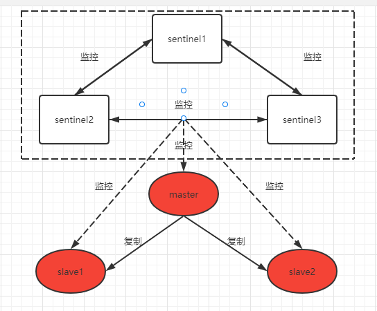

# Redis基础

# 基本数据类型

## 1. String 字符串

## 2. LIst 列表

## 3. Set 集合

## 4. SortedSet 有序集合

## 5. Hash 哈希

# 高级数据类型

## 1. Stream 消息队列(MQ)

- 生产信息
- 消费消息

## 2. Geospatial 地理空间

- 经度
- 纬度

## 3. HyperLogLog

## 4. Bitmap 位图

## 5. Bitfield 位域

# 高级内容

## 1. 发布订阅

- 发布消息
- 订阅消息
- 消息无法持久化，通过Stream消息队列实现持久化

## 2. 持久化

- **RDB**：快照
  - `redis.conf`配置文件
  - `save`命令
  - `bgsave`命令
- **AOF**：追加文件
  - `redis.conf`配置文件

## 3. 事务

- 与mysql中的事务概念不同
- 与shell脚本中**执行批量命令**的概念类似

## 4. 主从模式

## 5. 哨兵模式

# 高可用部署

## Redis 集群（一主两从三哨兵）

**整体架构**



**搭建步骤**

1. 使用3台服务器，**分别安装 redis，并进行防火墙设置**

| ip              | port | role   |
| --------------- | ---- | ------ |
| 192.168.180.197 | 6379 | master |
| 192.168.180.198 | 6380 | slave  |
| 192.168.180.199 | 6381 | slave  |

**配置主节点**（192.168.180.197）：

1. 修改主节点 redis.conf 配置文件：

```shell
# 主节点配置
bind 192.168.180.197  # 绑定主节点IP地址
port 6379             # 主节点端口号
daemonize yes         # 以守护进程模式运行
logfile "/var/log/redis/redis.log"  # 日志文件路径
save 900 1
save 300 10
save 60 10000
```

**配置从节点**（192.168.180.198、192.168.180.199）：

1. 修改从节点 redis.conf 配置文件：`replicaof 192.168.180.197 6379`

```shell
# 从节点配置
bind 192.168.180.198 (或者192.168.180.199)  # 绑定从节点IP地址
port 6380 (或者6381)            # 从节点端口号
daemonize yes         # 以守护进程模式运行
logfile "/var/log/redis/redis.log"  # 日志文件路径
save 900 1
save 300 10
save 60 10000
replicaof 192.168.180.197 6379  # 设置主从关系
```

**配置哨兵节点**：

1. **在每个哨兵节点（每台服务器）上创建 sentinel.conf 配置文件**
2. 并添加以下内容：`sentinel monitor mymaster 192.168.180.197 6379 2`

```shell
# 哨兵节点配置
port 26379 (或26380)(或26381)           # 哨兵节点监听端口
daemonize yes        # 以守护进程模式运行
logfile "/var/log/redis/sentinel.log"  # 日志文件路径
sentinel monitor mymaster 192.168.180.197 6379 2  # 监控主节点，指定当有2台哨兵认为主机挂了，则对主机进行切换
sentinel down-after-milliseconds mymaster 5000     # 故障判定时间
sentinel failover-timeout mymaster 60000          # 故障转移超时时间
sentinel parallel-syncs mymaster 1                # 同步复制的数量
```

2. 在发生主节点故障时，哨兵节点会检测到并触发故障转移。**其中一个从节点将被选举为新的主节点，并且哨兵节点会更新配置文件以反映这一变化**。因此，即使出现主从节点切换，哨兵节点仍然可以起到监控和自动故障转移的作用。

