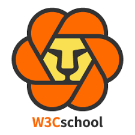
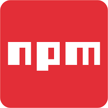
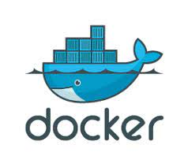
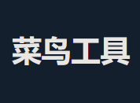
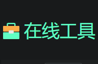
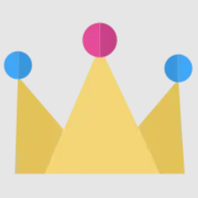
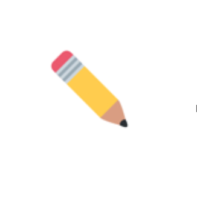
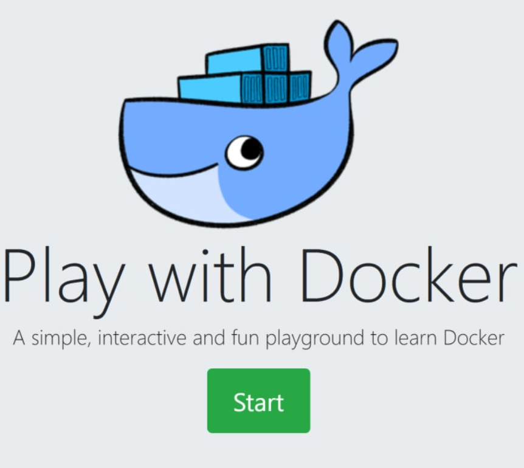

# 常用搜索

  <a href="https://google.com" target="_blank" class="nav-link">
    
    <h4>Google</h4>
    
全球最大的搜索引擎

  </a>

  <a href="https://baidu.com" target="_blank" class="nav-link">
    
    <h4>Baidu</h4>
    
中国最大的搜索引擎

  </a>

  <a href="https://www.bing.com" target="_blank" class="nav-link">
    
    <h4>Bing</h4>
    
微软公司的搜索引擎

  </a>

  <a href="https://www.youtube.com" target="_blank" class="nav-link">
    
    <h4>YouTube</h4>
    
全球视频分享平台

  </a>

  <a href="https://www.bilibili.com" target="_blank" class="nav-link">
    
    <h4>哔哩哔哩</h4>
    
中国视频分享平台

  </a>

  <a href="https://qianwen.aliyun.com" target="_blank" class="nav-link">
    
    <h4>通义千问</h4>
    
阿里巴巴人工智能模型

  </a>

  <a href="https://leetcode.com" target="_blank" class="nav-link">
    
    <h4>LeetCode</h4>
    
在线编程挑战平台

  </a>
  
  <a href="https://www.hello-algo.com" target="_blank" class="nav-link">
    
    <h4>Hello Algo</h4>
    
在线算法学习资源

  </a>

# 技术社区

  <a href="https://stackoverflow.com" target="_blank" class="nav-link">
    
    <h4>Stack Overflow</h4>
    
开发者问答社区

  </a>

  <a href="https://www.csdn.net" target="_blank" class="nav-link">
    
    <h4>CSDN</h4>
    
开发者社区CSDN

  </a>

  <a href=" https://www.cnblogs.com" target="_blank" class="nav-link">
    
    <h4>博客园</h4>
    
开发者社区博客园

  </a>

# 在线教程

  <a href="https://www.w3school.com.cn" target="_blank" class="nav-link">
    
    <h4>W3school</h4>
    
Web开发教程资源

  </a>

  <a href="https://www.w3cschool.cn/tutorial" target="_blank" class="nav-link">
    
    <h4>W3Cschool</h4>
    
各种教程资源

  </a>

  <a href="https://www.runoob.com" target="_blank" class="nav-link">
    
    <h4>菜鸟教程</h4>
    
各种教程资源

  </a> 

# 后端开发

  <a href="https://spring.io" target="_blank" class="nav-link">
    
    <h4>Spring</h4>
    
Spring官方网站

  </a>

  <a href="https://mybatis.org/mybatis-3/zh_CN/index.html" target="_blank" class="nav-link">
    
    <h4>MyBatis</h4>
    
Mybatis官方网站

  </a>

  <a href="https://mybatis.plus" target="_blank" class="nav-link">
    
    <h4>MyBatis Plus</h4>
    
Mybatis Plus官方网站

  </a>

# 前端开发

  <a href="https://www.bootcss.com" target="_blank" class="nav-link">
    
    <h4>Bootstrap</h4>
    
前端开发框架

  </a>

  <a href="https://cn.vuejs.org" target="_blank" class="nav-link">
    
    <h4>Vue</h4>
    
渐进式JavaScript框架

  </a>

  <a href="https://element.eleme.cn/#/zh-CN" target="_blank" class="nav-link">
    
    <h4>Element-UI</h4>
    
基于 Vue 2.0 的桌面端组件库

  </a>

# 代码托管

  <a href="https://github.com" target="_blank" class="nav-link">
    
    <h4>GitHub</h4>
    
全球最大的开源软件托管平台

  </a>

  <a href="https://gitee.com" target="_blank" class="nav-link">
    
    <h4>Gitee</h4>
    
中国最大的开源软件托管平台

  </a>

  <a href="https://about.gitlab.com" target="_blank" class="nav-link">
    
    <h4>GitLab</h4>
    
一体化DevOps平台

  </a>

# 官方仓库

  <a href="https://mvnrepository.com" target="_blank" class="nav-link">
    
    <h4>MVN Repository</h4>
    
Maven官方仓库

  </a>

  <a href="https://www.npmjs.com" target="_blank" class="nav-link">
    
    <h4>NPMJS</h4>
    
NPM官方仓库

  </a>

  <a href="https://hub.docker.com" target="_blank" class="nav-link">
    
    <h4>Docker Hub</h4>
    
Docker镜像官方仓库

  </a>

# 工具合集

  <a href="https://www.jyshare.com" target="_blank" class="nav-link">
    
    <h4>菜鸟工具</h4>
    
菜鸟教程的在线工具

  </a>

  <a href="https://tool.oschina.net" target="_blank" class="nav-link">
    
    <h4>开源中国工具</h4>
    
开源中国的在线工具

  </a>

  <a href="https://tool.lu" target="_blank" class="nav-link">
    
    <h4>Tool工具箱</h4>
    
程序员的工具箱

  </a>

# 推荐资源

  <a href="https://pdai.tech" target="_blank" class="nav-link">
    
    <h4>pdai.tech</h4>
    
Java 全栈知识体系

  </a>

  <a href="https://jwt1399.top" target="_blank" class="nav-link">
     
    <h4>简言之</h4> 
    
慢慢来，比较快！
 
  </a>

  <a href="https://cdk8s.gitbook.io/github/introduce" target="_blank" class="nav-link">
    
    <h4>IntelliJ-IDEA-Tutorial</h4>
    
IDEA 教程

  </a>

  <a href="https://labs.play-with-docker.com" target="_blank" class="nav-link">
     
    <h4>Play with Docker</h4> 
    
在线的Docker容器实验平台
 
  </a>

# 其他资源

  <!-- 根据css样式每行最少三个链接标签 -->
  <!-- 根据需要添加更多空链接直到填满一行 -->
  
  
  

<!-- 引入外部CSS文件 -->
<link rel="stylesheet" href="css/nav-styles.css">
<!-- 引入外部JavaScript文件 -->
